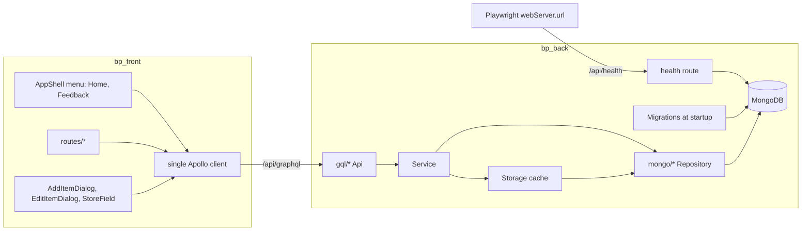
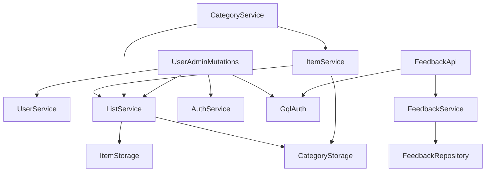
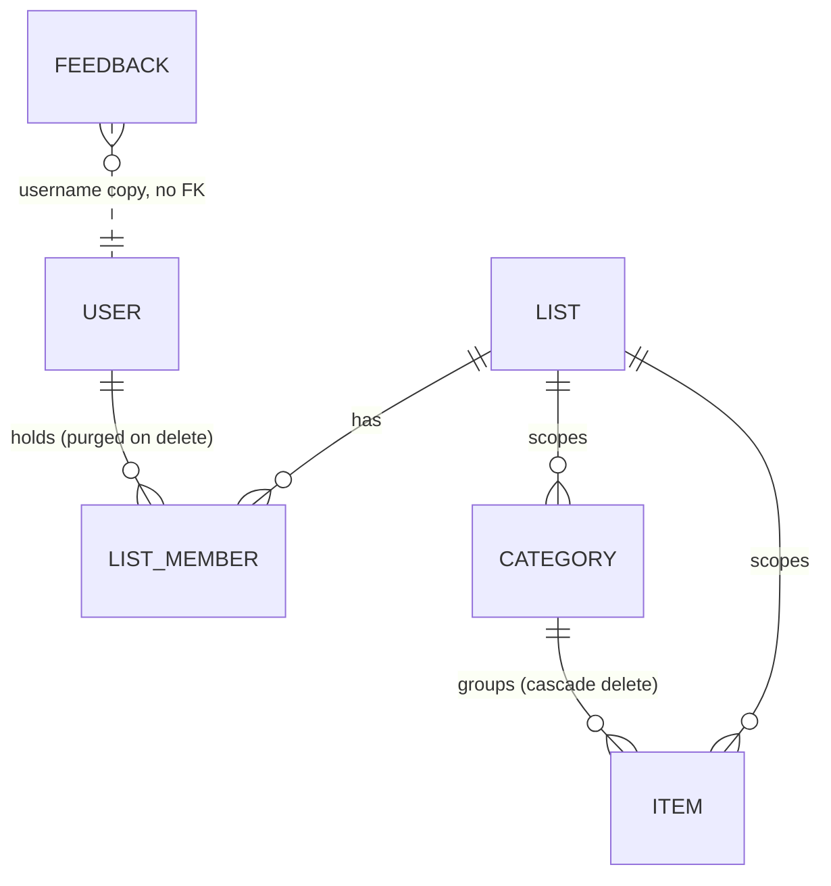

# Architecture Spine — Epic 9: User Feedback Pass

## Design Paradigm

A layered monolith built from per-entity vertical slices. Each backend entity is its own package, and calls go in one
direction only: GQL → Service → Storage (optional in-memory cache) → Mongo repository. The frontend is a single-page app
that talks to the backend through one Apollo client and a single GraphQL endpoint. Epic 9 adds one slice (`feedback`),
changes the shape of one field (`Item.store` → `stores`), and adds one plain HTTP route (`/api/health`). No new
dependency.



## Inherited Invariants

| Inherited                                                                                      | From parent                                  | Binds here                                                                               |
|------------------------------------------------------------------------------------------------|----------------------------------------------|------------------------------------------------------------------------------------------|
| Per-entity slice layout `entity/<name>/{Service,Storage,gql/,mongo/}`                          | `bp_back/CLAUDE.md`, code                    | The `feedback` slice and the `stores` change follow it                                   |
| NFR-L2 service-layer membership check before any list-scoped access                            | `architecture.md` (Epic 4)                   | Unchanged for member callers. The one caller-less exception is AD-8's admin-gated purge. |
| FR56 admin excluded from list ops (`caller != adminLogin` in service)                          | `architecture.md`, `ListService`             | Also covers `sendFeedback`                                                               |
| Admin GQL ops gated by the JWT `role` claim                                                    | `UserAdminApi.kt`, `ApplicationConfigApi.kt` | Consolidated into one helper (AD-2)                                                      |
| Startup migrations recorded in `app_migrations`, run before GQL is configured                  | `architecture.md`, `Application.kt`          | FR69 conversion (AD-5)                                                                   |
| Cascades are ordered, non-transactional Mongo deletes, followed by cache eviction              | `ListService.deleteList`                     | Category and user cascades (AD-7, AD-8)                                                  |
| Subscriptions filtered per list; `takeWhile` membership re-check on each event                 | `architecture.md`, `bp_back/CLAUDE.md`       | A purged member's stream ends on the next event                                          |
| One Apollo + `graphql-ws` client; access token in memory only                                  | Epic 5 reframe, `bp_front/CLAUDE.md`         | No new client for admin/feedback                                                         |
| Nothing under `/api` cached or served as fallback by the service worker                        | Story 7.14, `bp_front/CLAUDE.md`             | `/api/health` must reach Ktor                                                            |
| E2E is UI-driven, desktop + mobile projects, 320px floor; API calls only for environment setup | NFR17, NFR18, NFR64/65                       | Every Epic 9 story                                                                       |

## Invariants & Rules



### AD-1 — Feedback is a repository-backed slice without cache or subscription

- **Binds:** FR66, FR67
- **Prevents:** one story adding an in-memory cache or a live subscription while another reads Mongo directly; feedback
  records vanishing with their author; a delete that silently matches nothing.
- **Rule:** `entity/feedback/` holds `Feedback`, `FeedbackService`, `mongo/FeedbackRepository` (collection `feedback`),
  and `gql/FeedbackApi`, following the user/config pattern: no Storage cache, no SharedFlow, no subscription. Document
  fields: `_id` UUID stored as a string through `UUIDSerializer` and filtered with `id.toString()`; `text`; `username`
  (a plain string copied from the principal, not a reference to a user id); `createdAt` Instant. Deleting a user never
  touches this collection. `com.bagplease.entity.feedback.gql` is added to the schema `packages` in `GQL.kt`.

### AD-2 — Feedback authorization and validation are server-owned; one admin gate

- **Binds:** FR66, FR67, FR56, FR17
- **Prevents:** a client that stamps its own author or time; the admin sending feedback through the API; the client and
  server applying the 2000-character limit to different strings; a third private copy of the admin check.
- **Rule:**
    - The two private `requireAdmin()` copies move into one `DataFetchingEnvironment.requireAdmin()` in
      `plugins/GqlAuth.kt`, which checks the `role` claim. `UserAdminApi`, `ApplicationConfigApi`, and `FeedbackApi` all
      use it.
    - `sendFeedback(text: String!): Boolean!` takes only the text. The service rejects the admin
      (`caller != adminLogin`) with Forbidden. It measures `text.trim().length` (UTF-16 code units) and rejects blank or
      longer than 2000 with `GraphQLInvalidInputException`. It stores the trimmed text, sets `username` from the
      principal, and sets `createdAt` from the server clock.
    - `feedback: [Feedback!]!` returns entries ordered by `createdAt` descending, then `_id`, unpaginated.
      `deleteFeedback(id: ID!): ID!` returns the deleted id. Both call `requireAdmin()`.
    - The client validates the same trimmed length and puts no `maxLength` on the raw input. It renders feedback text
      only as React text nodes (never `dangerouslySetInnerHTML` or markdown), confirms deletes with the existing
      `ConfirmDialog`, and never re-sorts the list.

### AD-3 — `stores: [String!]!` replaces `store` in every layer, in one story

- **Binds:** FR44, FR69, FR60
- **Prevents:** a backend story adding `stores` next to `store` while a frontend story keeps writing `store`; a
  string-literal `"store"` that compiles and silently keeps writing the old field.
- **Rule:**
    - One story changes all of: `Item.stores: List<String>`, `MongoItem.stores: List<String> = emptyList()`,
      `GqlItem.stores: [String!]!`, `ItemInput.stores: [String!]!`, `MongoItemMapper`, `GqlItemMapper`, and
      `ItemRepository.save`.
    - In that same story, `ItemRepository.save` writes `Updates.set("stores", …)` and `Updates.unset("store")` in one
      update. It also ships the AD-5 migration and removes `store` from the schema, updates every frontend document
      through the `ListItemFields` fragment (Frontend data convention), and updates the raw GraphQL in
      `e2e/item-editing.spec.ts`.
    - Backend and frontend ship in one app version (`gradle.properties` and `package.json` stay equal).
    - `saveItem`'s update branch copies `name`, `category`, `stores`, `recurring` from the input. The check state goes
      through AD-11.

### AD-4 — The server normalizes store names; identity is case-insensitive, casing is data

- **Binds:** FR44, Phase 3 store mode
- **Prevents:** "Lidl" and "lidl " stored as two stores on one item; suggestion chips that switch casing between
  requests; a casing-only fix that the UI treats as "no change".
- **Rule:**
    - The reference normalizer is Kotlin: trim each name with `trim()`, drop empty ones, and dedupe by
      `lowercase(Locale.ROOT)`, keeping the casing and position of the first occurrence. Internal whitespace is kept.
      `ItemService.saveItem` applies it to both create and update.
    - Store identity (dedupe, suggestions, future store filters) is the lowercased key. The stored casing is display
      data.
    - `itemStoreSuggestions` returns one name per key. When several spellings share a key, the one kept is the lowest by
      `(lowercase, then String.compareTo)`. Results are sorted by that same order.
    - The frontend mirror in `lib/lists/storeValue.ts` uses `trim()` + `toLowerCase()` (never `toLocaleLowerCase()`). It
      stops duplicates by key but treats "changed or unchanged" by exact string equality, so a casing-only edit saves.
      The server's result after the save is authoritative.

### AD-5 — Migrations are independent, self-recorded, and keyed on the legacy field

- **Binds:** FR69, FR47
- **Prevents:** the FR69 conversion being skipped because `configureMigration` returns early once `epic4-list-seed` is
  recorded; legacy `store` values lost on documents that new code already saved with `stores`; a half-converted
  collection after a crash; a copied `Updates.set("stores", "$store")` that writes the literal string.
- **Rule:**
    - `configureMigration` runs migrations in the declared order `[epic4-list-seed, epic9-multi-store]`. Each one checks
      only its own `app_migrations` `_id`, keeps its existing record behaviour, and never short-circuits the others.
    - `epic9-multi-store` ships in the AD-3 story. It processes documents one at a time: every item document where
      `store` exists gets `stores` set to the AD-4 normalizer's result for `(existing stores ?: []) + [store]` (null or
      blank `store` adds nothing), and `store` is unset.
    - The completion record is written last. It runs before `configureGql`, so no storage cache has been populated yet.
    - Its test seeds legacy-only, `stores: []` with a leftover `store`, null/blank/padded `store`, and already converted
      documents, with `epic4-list-seed` already recorded.
    - The deploy of the release that carries it takes a `mongodump` of the `db_data` database first. Rollback means
      restoring the dump and running the previous image.

### AD-6 — User listing is paginated on the server; a created user is located by the server

- **Binds:** FR13, D4, `/admin` 320px carry-in
- **Prevents:** a client that pages a full `users` list; E2E helpers that can't find a user who landed on another page;
  page-walks broken by concurrent registrations; cached pages showing rows shifted by a delete.
- **Rule:**
    - The query is `users(limit: Int!, offset: Int, around: String): UserPage!`, returning
      `UserPage { users: [User!]!, totalCount: Int!, offset: Int! }`. Users are sorted by `username` ascending with
      Mongo's default binary collation, matching the unique index.
    - The server clamps `limit` to 1..100 and `offset` to 0..last page. When `around` names an existing username, the
      server ignores `offset` and returns the page containing that user, with that page's `offset`.
    - The frontend page size is 20, and `/admin` shows `totalCount`. After a create, the client queries with
      `around: <new username>`. After a delete, it queries with `offset: min(current, lastPage)` based on the returned
      `totalCount`.
    - `AdminUsersQuery` uses `fetchPolicy: 'cache-and-network'`. Every successful `createUser` or `deleteUser` calls
      `cache.evict({fieldName: 'users'})` and `cache.gc()` before the next page query.
    - E2E helpers act on a created user only on the page the create landed on, never by page-walking. Test ids:
      `admin-users-prev`, `admin-users-next`, `admin-users-page`, `admin-users-total`.
    - The unpaginated `users` field is removed.

### AD-7 — Category delete: cascade on the server, the client prunes, no orphan entry points

- **Binds:** carry-in "deleting a category deletes its items", FR58, FR41, FR52/FR53, FR68
- **Prevents:** ghost items on other members' screens when a burst of per-item events is lost in the one-slot
  `DROP_OLDEST` SharedFlow; soft-deleted one-timers restored by undo into a deleted category; the FAB creating an item
  in a category that was just deleted.
- **Rule:**
    - **Server writes:** `CategoryService.deleteCategory` checks membership, deletes the category through
      `CategoryStorage`, then calls `internal ItemService.deleteAllInCategory(listId, categoryId)`. That call removes
      every item with that category from Mongo and from the per-list storage map, including items with `deleted = true`.
    - **Server events:** the cascade emits only the category `DELETED` event, never per-item events.
    - **Client:** a category `DELETED` event is authoritative for its children. On `/list/:id` and `/lists/:id` the
      handler removes every cached item whose `category` equals the deleted id from that list's items query. The
      client-side item delete loop in `ListDetailPage` is removed.
    - **Orphan entry points:** `saveItem` rejects a category outside the target list on both the create and update
      branches, using the existing message, and the create-hole tripwire test is retired. `uncheckItem` rejects an item
      whose category no longer exists. `AddItemDialog` maps that error through the same path `EditItemDialog` uses.
    - **E2E:** deletes a category holding at least 5 items while a second member watches `/list/:id`.

### AD-8 — `ListService` alone writes membership; user deletion runs an admin-gated purge

- **Binds:** carry-in "deleting a user removes their list memberships", FR15, FR17, FR40, FR55
- **Prevents:** a repository bulk `$pull` that leaves `ListStorage` saying the user is still a member (so the phantom
  comes back on the next save); the deleted user creating a list in the window before purge; two copies of the list
  cascade, or a fake owner caller passed into `deleteList`.
- **Rule:**
    - Only `ListService` writes to `list_members` or to `List.members`/`memberUsernames`.
    - `UserAdminMutations.deleteUser` (after `requireAdmin()`) runs these steps in order: (1)
      `UserService.adminDeleteUser`, so `createList`/`acceptInvite` from then on fail with `CallerNotFound`; (2)
      `ListService.purgeUser(userId, username)`; (3) `AuthService.invalidateUserSessions`.
    - `purgeUser` is the only list-mutating entry point that has no caller, and it is idempotent. It writes only through
      `ListStorage.save` and `ListMemberRepository`, and never through a `ListRepository` bulk update. It removes every
      `list_members` row for the user id in any status. On lists the user belongs to without owning, it removes the user
      from `members` (by id) and `memberUsernames` (by name).
    - Lists the user owns are deleted with all their items and categories through a private `cascadeDeleteList(list)`
      that `deleteList` also calls after its owner check. `DeleteUserDialog` (FR17) states how many owned lists will be
      deleted, read from `User.ownedListCount: Int!`.
    - List deletion, by an owner or by the purge, emits no subscription event. Other members get redirected on their
      next Forbidden response (Story 5.6), and the E2E test asserts only that.

### AD-9 — Readiness is `/api/health`

- **Binds:** carry-in F20 / Story 7.12, NFR17
- **Prevents:** readiness probes that only show Caddy is up; a route declared as `/api/health` that ends up at
  `/api/api/health` under Ktor's `rootPath`; a probe that hangs 30s on a down Mongo; a compose healthcheck that calls a
  tool the image doesn't contain.
- **Rule:**
    - Declared as `get("/health")` inside `routing {}`, outside `authenticate` and any `rateLimit`. It is served
      publicly at `/api/health` through `rootPath: "api"`.
    - It runs a Mongo `ping` inside `withTimeout(2.seconds)`. Success returns `200`; any exception or timeout returns
      `503`.
    - The backend test calls `/api/health` through `testApplication` with the real config.
    - `playwright.config.ts` `webServer.url` is `http://localhost:2080/api/health`. A compose healthcheck, if added,
      runs on `bp_front` with busybox `wget -qO- http://localhost/api/health`. No probe tool is added to the `bp_back`
      image.
    - The service-worker `/api` denylist stays as it is.

### AD-10 — One add-item dialog; account-menu entries live in `AppShell`

- **Binds:** FR68, FR57, FR66, FR44/FR60
- **Prevents:** a FAB story building a second add-item form that drifts from the management screen; Home/Feedback
  entries built separately on each page; the multi-store row being named or test-id'd differently by different stories.
- **Rule:**
    - The shopping-view FAB opens the existing `AddItemDialog` with the current `listId`. There is no second add dialog,
      and `AddItemDialog` owns the no-categories guidance.
    - `StoreField` becomes one multi-value component (`value: string[]`) used by both item dialogs.
    - `AppShell` adds the Home and Feedback account-menu entries, once. Home reuses `useHomePath('observe')` and the
      existing `alreadyHome` comparison (on home it only closes the menu), and the existing `Lists` entry stays.
      Feedback is hidden when the auth role is `admin`, and it opens a dialog rendered by `AppShell`, not a route, so
      the user's current screen stays mounted.
    - The shopping row's accessible name stays exactly `` `Toggle ${item.name}` ``; `Stores: A, B` goes in the row's
      accessible description beside `addedBy`, and the segment is left out when the item has no stores (md ruling,
      2026-09-15, epics.md UX-DR-E9-7). Store chips stay non-interactive inside the FR60 row control. Test ids: `shopping-item-stores-<item>` for
      the container, `shopping-item-store-<item>-<store>` for each chip.

### AD-11 — One check-state transition for every item mutation

- **Binds:** carry-in "`saveItem` stamps `checkedAt` when it checks an item", FR42, FR43, FR54, FR58
- **Prevents:** `saveItem` stamping `checkedAt` on a one-timer (a checked item that is never hard-deleted), or never
  stamping a recurring item checked through an edit (the scheduler skips it forever); the FR44 story and the carry-in
  reading "merge as before" in opposite ways.
- **Rule:**
    - `ItemService` has one private `applyCheckState(stored, checked, recurring, now)`, used by `checkItem`,
      `uncheckItem`, and `saveItem`'s update branch.
    - Checked, `ONE_TIME`: `deleted = true` and `deletedAt = now`.
    - Checked, recurring cadence: `checkedAt = stored.checkedAt ?: now`, also when only `recurring` changed.
    - Checked, no cadence: nothing is stamped.
    - Unchecked: `checkedAt`, `deleted`, and `deletedAt` are cleared.
    - Every other server-owned field survives the save (FR58).

## Consistency Conventions

| Concern       | Convention                                                                                                                                                                                                                                                                                                                                                                                                                            |
|---------------|---------------------------------------------------------------------------------------------------------------------------------------------------------------------------------------------------------------------------------------------------------------------------------------------------------------------------------------------------------------------------------------------------------------------------------------|
| Naming        | GraphQL: `sendFeedback`, `feedback`, `deleteFeedback`, `users(limit, offset, around)`, `stores`; types `Feedback`, `UserPage`. Kotlin `Gql*` classes with `@GraphQLName`. Migration ids `epic<N>-<slug>`. Dialog test ids namespaced by prefix (`add-item-*`, `edit-item-*`, `feedback-*`).                                                                                                                                           |
| Ids & time    | Feedback UUIDs are generated by the server; item ids by the client (FR58). All UUID `_id`s are stored as strings and filtered with `toString()`. Instants go through `InstantBsonSerializer` in Mongo and are ISO-8601 in GraphQL.                                                                                                                                                                                                    |
| Errors        | Reuse `GraphQLForbiddenException` / `GraphQLInvalidInputException` / `GraphQLNotFoundException`; no new error envelope.                                                                                                                                                                                                                                                                                                               |
| Events        | List-scoped mutations emit on their service's SharedFlow after the write. Cascades emit only the parent event (AD-7), and clients prune children. Feedback, users, and list deletion emit nothing.                                                                                                                                                                                                                                    |
| Frontend data | Every operation returning an `Item` spreads one fragment, `ListItemFields`, in `lib/lists/listsQueries.ts`. No hand-written item field lists, and `subscribeToMore` handlers use the generated fragment type. Admin operations live in `lib/admin/adminQueries.ts`, and admin collections use `cache-and-network` plus evict-on-mutation. Codegen is regenerated in the same story as the schema change; never edit `__generated__/`. |
| Notices       | No toast or snackbar (none exists in `src/`; md ruling, 2026-09-15, epics.md UX-DR-E9-1). FR66 send confirmation is an in-flow `<Alert severity="success" role="status">` rendered by `AppShell`; an FR67 delete is confirmed by the row disappearing. A failed send keeps the dialog open with the text intact and the error inline.                                                                                              |
| Tests         | Backend: Kotest + Testcontainers for each backend rule: normalization, migration seeds, cascades including soft-deleted items, purge idempotency, admin rejection, health 200/503. E2E: UI-driven per FR on both projects, with a 320px overflow assertion on `/admin`, the feedback dialog, the FAB, and the multi-store row.                                                                                                        |

## Stack

Repo pins as of 2026-09-15; Epic 9 upgrades nothing.

| Name                            | Version                      |
|---------------------------------|------------------------------|
| Kotlin                          | 2.4.10                       |
| Ktor                            | 3.5.2                        |
| graphql-kotlin                  | 10.2.1                       |
| MongoDB Kotlin coroutine driver | 5.9.2                        |
| MongoDB server                  | mongo:8 (floating 8.x tag)   |
| React                           | 19.2.8                       |
| Apollo Client                   | 4.2.11                       |
| MUI                             | 9.3.1                        |
| graphql (JS)                    | 17.0.2                       |
| TypeScript                      | 6.0.3                        |
| Vite                            | 8.2.1                        |
| Playwright                      | 1.62.1 (lock; range ^1.60.0) |
| App version at start            | 0.18.0                       |

## Structural Seed

```text
bp_back/src/main/kotlin/com/bagplease/
  entity/feedback/            # NEW slice (AD-1, AD-2)
  entity/item/                # stores in Item, MongoItem, Gql*, both mappers, ItemRepository.save;
                              #   applyCheckState; deleteAllInCategory (AD-3, AD-4, AD-7, AD-11)
  entity/category/            # CategoryService cascade (AD-7)
  entity/list/ListService.kt  # purgeUser, private cascadeDeleteList (AD-8)
  entity/user/gql/            # users(limit, offset, around) -> UserPage; deleteUser order (AD-6, AD-8)
  plugins/GqlAuth.kt          # NEW shared requireAdmin (AD-2)
  plugins/Migration.kt        # ordered independent migrations + epic9-multi-store (AD-5)
  plugins/Routing.kt          # get("/health") (AD-9)
  plugins/GQL.kt              # register feedback Query/Mutation + packages entry
bp_front/src/
  components/AppShell.tsx     # Home + Feedback entries, FeedbackDialog host (AD-10)
  components/StoreField.tsx   # multi-value (AD-10)
  components/AddItemDialog.tsx# reused by the FAB (AD-10)
  routes/AdminPage.tsx        # paginated users, feedback section (AD-6, AD-2)
  routes/ListShoppingPage.tsx # FAB, category-DELETED prune, stores row (AD-7, AD-10)
  routes/ListDetailPage.tsx   # client delete loop removed, category-DELETED prune (AD-7)
  lib/lists/listsQueries.ts   # ListItemFields fragment (Frontend data convention)
  lib/lists/storeValue.ts     # client mirror of the normalizer (AD-4)
bp_front/playwright.config.ts # webServer.url -> /api/health (AD-9)
```



## Capability → Architecture Map

| Capability / Area                                                                    | Lives in                                                                                 | Governed by                                                                                                                                       |
|--------------------------------------------------------------------------------------|------------------------------------------------------------------------------------------|---------------------------------------------------------------------------------------------------------------------------------------------------|
| FR66 send feedback                                                                   | `AppShell` dialog → `sendFeedback` → `entity/feedback`                                   | AD-1, AD-2, AD-10, Notices                                                                                                                        |
| FR67 review/delete feedback                                                          | `AdminPage` → `feedback`, `deleteFeedback`, `ConfirmDialog`                              | AD-1, AD-2                                                                                                                                        |
| FR56 admin scope                                                                     | `FeedbackService`, `plugins/GqlAuth.kt`                                                  | AD-2                                                                                                                                              |
| FR44 multi-store (+ `EditItemDialog` stale comments, orphan dialog closing silently) | `StoreField`, item dialogs, `ItemService.saveItem`, `itemStoreSuggestions`, shopping row | AD-3, AD-4, AD-10; comment and dialog fixes are story-level                                                                                       |
| `checkedAt` stamping carry-in                                                        | `ItemService.applyCheckState`                                                            | AD-11                                                                                                                                             |
| FR69 store conversion                                                                | `plugins/Migration.kt`                                                                   | AD-5                                                                                                                                              |
| FR13 pagination (+ D4, `/admin` 320px cell)                                          | `UserAdminQueries.users`, `AdminPage`, `e2e/admin.spec.ts`                               | AD-6                                                                                                                                              |
| FR68 quick-add FAB                                                                   | `ListShoppingPage` → `AddItemDialog`                                                     | AD-10, AD-7 (create check)                                                                                                                        |
| FR57 Home menu entry (+ `/lists` dead end, `useHomePath` branch order)               | `AppShell`, `lib/lists/homePath.ts`                                                      | AD-10; cold-start home-link behaviour stays as is (cache-only observe)                                                                            |
| FR61 filter confirm (+ F2, F5)                                                       | `ListFilters.tsx`, `lib/lists/order.ts`                                                  | Story-level; F5 is de-keyed: the synthetic `Uncategorized` bucket is keyed by a sentinel id, frontend-only, and `saveCategory` gains no name rule |
| Category delete cascade                                                              | `CategoryService` → `ItemService`; both list pages                                       | AD-7                                                                                                                                              |
| User delete purges memberships                                                       | `UserAdminMutations` → `ListService.purgeUser`                                           | AD-8                                                                                                                                              |
| Health endpoint / E2E readiness                                                      | `plugins/Routing.kt`, `playwright.config.ts`                                             | AD-9                                                                                                                                              |
| Small cleanups                                                                       | repo hygiene, `UserService`, `ListStorage.delete()`, theme tokens                        | Story-level; runs after the `AppShell` stories and deletes only `custom.bp.*` tokens still unused at that point                                   |

## Deferred

- **Transactions for cascades:** stays non-transactional per the inherited convention; revisit if a partial cascade is
  seen in production data.
- **Username reuse after deletion:** an access token issued before deletion (15 min at most) or an open WebSocket still
  authenticates by username, so if the same name is registered again within that window it could act as the new account.
  This problem already exists and deletion is admin-only. Revisit if self-registration is turned on.
- **Feedback pagination and rate limit on `sendFeedback`:** volume is small and the admin clears feedback as they triage
  it; revisit on abuse or when the list no longer fits a screen.
- **Limit on stores per item; server-side limit on store-name length:** `STORE_MAX` applies per name on the client. The
  FR44 story may add the matching server check without an AD.
- **Phase 3 single-store shopping mode:** AD-4's identity rule is the only groundwork fixed now.
- **F2 (explicitly selected empty category stays visible):** frontend-only, inside the FR61 story.
- **Per-run E2E data hygiene (D4 beyond pagination):** the mechanism is chosen at story level within NFR18. AD-6 removes
  the render-time cause.
- **Playwright `webServer` teardown and stdout filtering** (the rest of F20): chosen at story level in the health story.
- **`/admin` page number in the URL:** only the pagination story touches it.
- **Operational envelope** (compose topology, edge proxy, image build and versioning): owned by
  `docs/architecture-routing.md` and `docs/deployment-guide.md`. Epic 9 adds only the pre-deploy `mongodump` (AD-5) and
  the optional `bp_front` healthcheck (AD-9).
