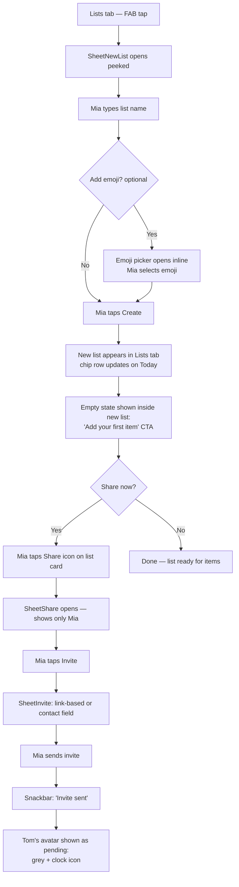
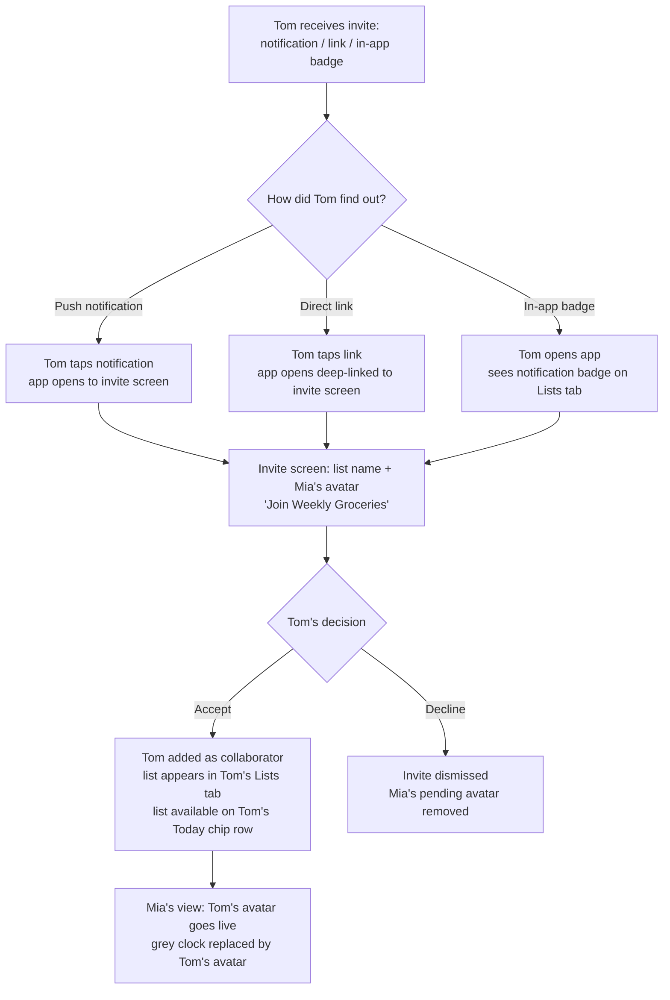
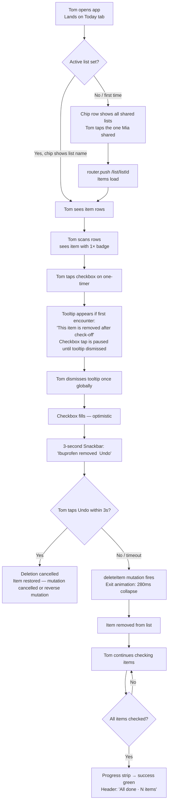
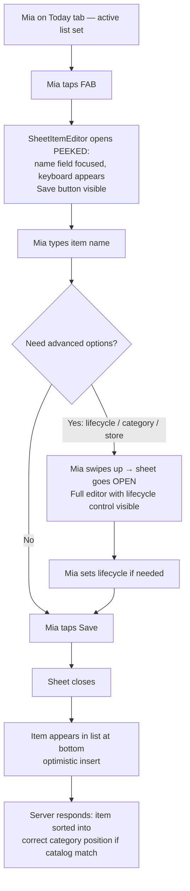
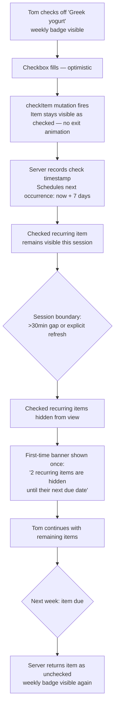
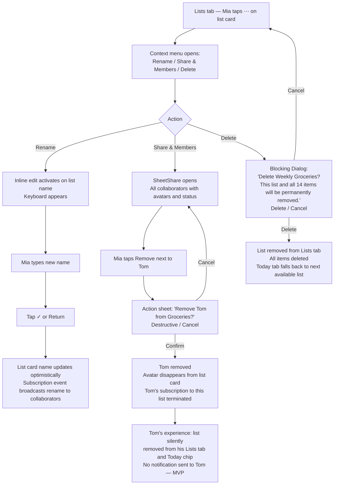

# UX Design Specification bag-please — Epic 4: Personal Lists & Sharing

**Author:** md
**Date:** 2026-05-18

---

<!-- UX design content will be appended sequentially through collaborative workflow steps -->

## Executive Summary

### Project Vision

Always know what to buy and who's handling it, across every list in your
life. Epic 4 gives each household member their own lists, lets them share
selectively, and makes item lifecycle explicit — so the list stays clean
without anyone having to manually tidy it.

### Target Users

**Household anchor (Mia)**
The person who set up the household and owns the primary lists. Mobile-
first, switches between a grocery list and occasional side trips. Creates
lists, assigns emoji, shares with Tom. Her failure mode: she checks off a
one-timer and Tom, who was mid-shop, asks where it went. She needs
confidence that the sharing and lifecycle settings she chooses are visible
to collaborators *before* they act, not after.

**Invited collaborator (Tom)**
Added to a specific list by Mia — doesn't manage lists, just shops from
them. His failure mode: he checks off an item and it disappears. Was that
intentional? Did he delete it by accident? Tom is the user most likely to
be alarmed by one-timer behavior. The collaborator experience must make
lifecycle intent legible at the item row level, before the tap.

### Key Design Challenges

1. **Item lifecycle legibility** — five post-check behaviors exist (stay
   checked · one-timer auto-delete · weekly · biweekly · monthly). Both
   the item row and the editor sheet must signal which behavior is set
   *before* the user taps. Tom's confusion is the test: if he can't tell
   a one-timer from a regular item at a glance, the design has failed.

2. **Active list identity on Today** — the Today tab is the primary
   screen but mutations (add item, check off, edit) must always act on a
   specific list. Users must know unambiguously which list they are
   shopping from. The failure mode: user adds an item and it lands in
   the wrong list. The chip switcher is the key affordance; it must
   make the active list both obvious and easy to change.

3. **Sharing mental model** — "sharing" must be defined before users
   encounter it. In bag-please, sharing means full peer write access: the
   invitee can add, check off, and edit items. There is no read-only mode.
   The share sheet and invite flow must set this expectation clearly
   upfront so users are not surprised by a collaborator's edits.

4. **Gestural ambiguity at the bottom** — bottom tab navigation and
   bottom sheets occupy the same spatial zone. Swipe-up from the bottom
   edge, tapping a tab, and opening a sheet are three different gestures
   that can feel identical. Sheet dismiss and tab navigation must be
   clearly differentiated.

5. **First-run and migration context** — existing users arrive with one
   global list; Epic 4 migrates their items to a default admin-owned list.
   New users start with zero lists. Both paths require distinct empty
   states and first-run flows. The "Create your first list" CTA is the
   most important call-to-action in the app for new users.

### Design Opportunities

1. **One-timer as effortless list hygiene** — one-off purchases
   (medicine, a hardware store item, a single recipe ingredient) disappear
   on first check-off with no manual clean-up. This reframes a
   potentially alarming behavior as a deliberate power move. Disclosure
   design is critical: the item must carry a visible signal *before* it
   is checked, so the disappearance is expected, not a surprise.

2. **List chip switcher as fluid multi-tasking** — the horizontal chip
   row at the top of Today makes the active list both obvious and
   instantly switchable. Item counts on each chip surface urgency without
   leaving the shopping view. This is a core navigation decision, not a
   nice-to-have.

3. **Empty states as onboarding moments** — the zero-lists state on the
   Lists screen and the zero-items state on Today are the first things
   new users and migrating users see. Treating them as designed moments
   (not just placeholder text) builds trust in the new information
   architecture.

### Implementation Notes

- **Theme:** Standard MUI `ThemeProvider` with a custom `theme.ts` that
  maps color tokens from `design/theme.js`. `CssVarsProvider` was
  evaluated and deferred — the complexity is not justified for current
  scope. This overrides the CSS vars mode decision in `architecture.md`;
  that document's resolved decision AR3 must be updated accordingly.
- **One-timer backend:** the `recurring` / lifecycle field on Item must
  treat `one-time` as a distinct named value, not a flag. The deletion
  path on check-off is a separate mutation, not a side effect of the
  check mutation. The architecture must keep these states explicit.

## Core User Experience

### Defining Experience

The job users hire bag-please to do is: **get out of the store without
forgetting anything and without calling home.** This is a confidence job,
not a speed job. The design must optimize for "I trust this list" as much
as for "I can tap fast."

The core loop is: open Today, check things off, leave. The secondary loop
— equally important — is: open Today, notice something's missing, add it
fast, leave. Both loops happen in the same screen, often in the same
session. Neither can have friction.

The single action that must be perfect is the **check-off tap**. One tap,
no confirmation, immediate visual feedback. The item either stays checked,
exits (one-timer), or schedules its own return (recurring). A collaborator
who checks an item and sees it vanish must immediately understand whether
that was intentional — the design, not a tooltip, carries that signal.

### Platform Strategy

- **Mobile-first web app** — Next.js App Router, touch-based, portrait
  orientation, no native app wrapper.
- **No offline requirement** — GraphQL subscriptions require a live
  connection; the app is designed for in-store use with connectivity.
- **Bottom navigation as the primary chrome** — Today · Lists · Household
  are always one tap away. The nav bar is persistent and never obscured.
- **Sheets as the interaction layer** — all create/edit/share actions
  happen in `BPSheet` overlays. They slide over the current screen
  without destroying scroll position or list state.
- **Active list = URL** — the `listId` in `/list/[listId]` is the
  authoritative source of truth for which list is active. Chip-row
  switching changes the URL via `router.push({ scroll: false })`. This
  must be set explicitly on every chip tap — omitting it causes App
  Router to scroll-reset to the top of the page.

### Effortless Interactions

These must require zero thought:

1. **Check off an item** — single tap on the row; no long-press, no
   swipe, no confirmation. One-timer items exit with an animation that
   signals intent. Requires Apollo optimistic update: UI responds before
   server confirms. On mutation failure, item snaps back.
2. **Undo a check-off** — a snackbar appears for 4 seconds after every
   check-off with a single "Undo" action. This is the safety net that
   makes the no-confirmation policy feel safe, not reckless. Applies to
   both regular and one-timer items (one-timers: undo restores the item
   and clears the deletion mutation).
3. **Add an item while shopping** — tap +, type name (autocomplete from
   existing items surfaced immediately), tap Add. Defaults to active list
   and first category. Optimized for one-thumb, mid-aisle speed.
4. **Switch the active list** — single tap on a chip in the Today chip
   row; URL updates with `scroll: false`, item list updates from cache
   or shows a brief loading state if the list has not been fetched yet.
5. **Return to shopping** — tap the Today tab from anywhere; returns to
   the active list's item view with no sub-navigation.

### Critical Success Moments

1. **First check-off** — progress bar advances. If it was a one-timer,
   it exits with a directional animation (slides out or fades) that
   reads as "gone on purpose." This is Tom's introduction to one-timer
   behavior; the animation must make intent legible without a label.
2. **First item added to a new list** — not the list creation itself, but
   the moment the first item appears in an empty list. The empty-state
   prompt ("Tap + to add your first item") converts the blank canvas
   into an invitation. Success is the list having something in it.
3. **List complete — all items checked** — when the last item is checked
   off, the progress bar fills, and the app signals completion. This is
   the job completion event: "you can leave the store." Without a
   designed ending, users are left wondering if they missed something.
4. **Real-time collaboration** — a collaborator's action (check-off or
   add) appears on Mia's screen via subscription, with the `addedBy`
   avatar visible on the item row. The moment a second person acts on
   a shared list proves the collaboration model is working.
5. **Recurring item returns** — a weekly item reappears on Monday morning
   without any user action. The "it just knew" moment is the emotional
   payoff that justifies the entire lifecycle complexity. If users never
   notice recurrence working, the feature is invisible.

### Experience Principles

1. **Declared intent, no surprises** — one-timer and recurring behavior
   is set at creation and visible on the item row before the tap. A
   collaborator must be able to read a one-timer's intent without opening
   the editor. This is the trust principle; it supersedes speed.
2. **Shopping first** — the check-off tap is the fastest action in the
   app. Nothing — no sheet, no prompt, no animation delay — adds friction
   to the core loop. Undo is always available but never required.
3. **List identity is always visible** — the active list is never
   ambiguous. The chip row, the toolbar title, and the URL are all in
   agreement at all times.
4. **Sheets overlay, not replace** — closing any sheet returns the user
   to exactly the screen and scroll position they left. Shopping is
   temporarily overlaid, never interrupted.
5. **Graceful recovery over perfect input** — users will check off the
   wrong item, assign the wrong list, mistype a name. Correction must
   feel as low-friction as the original action. Undo, edit, and delete
   are always reachable within one tap from any item.

### Implementation Contracts

These must be locked down before stories are written:

- **Optimistic update + rollback on check-off:** UI updates before server
  confirms. On GQL error, item reverts to unchecked. One-timer animation
  must not complete if the mutation fails — `ItemCard` needs an
  `isExiting` state (local `useState`) independent of Apollo cache so
  the animation can be cancelled on rollback.
- **List switch loading state:** switching to a list not yet in cache
  shows a loading indicator on the item area (not a full page load). The
  chip row and toolbar remain responsive during the fetch.
- **"List complete" trigger:** detected client-side when all items in the
  active list have `checked: true` after a check-off mutation resolves.
  The completion state is visual only — no mutation, no server round-trip.

## Desired Emotional Response

### Primary Emotional Goals

**Confident** — "I trust this list. I can leave the store."
This is the dominant emotional goal. Users shouldn't finish a shopping
trip wondering if they missed something. Every design decision — lifecycle
visibility, list identity, real-time sync — serves this feeling.

**In control** — "Things happen because I decided, not by accident."
Mia set the one-timer. She shared the list. Items behave the way she
configured them. Tom, as a collaborator, trusts that the list reflects
deliberate choices, not bugs.

**Relieved** — "The list takes care of itself."
One-timers disappear. Recurring items return. The app does the
housekeeping that users currently do manually. The emotional payoff is
noticing that the list is already clean without anyone tidying it.

### Emotional Journey Mapping

| Moment                    | Target emotion                                       | Design vehicle                                                      |
|---------------------------|------------------------------------------------------|---------------------------------------------------------------------|
| Opening Today             | Oriented — "I know where I am and what's on my list" | Chip row active state, toolbar title, item count                    |
| Shopping (checking off)   | Rhythmic satisfaction — each tap closes a loop       | Progress bar advance, smooth check animation                        |
| One-timer exits           | "Oh, nice" — expected, not alarming                  | Pre-announced by item row icon; exit animation reads as intentional |
| List complete             | Released — "I'm done, I can go"                      | Completion state on progress bar; celebratory micro-moment          |
| Check-off mistake         | Calm — "I can fix this immediately"                  | Undo snackbar, always present for 4 seconds                         |
| Collaborator acts on list | Connected — "We're working together"                 | addedBy avatar on item row; real-time via subscription              |
| Returning next week       | Trusted — "It remembered"                            | Recurring items already on the list; no user action required        |
| First-time empty list     | Invited — "I know what to do next"                   | Designed empty state with specific, warm CTA                        |

### Micro-Emotions

**To cultivate:**

- **Confidence** — chip row + toolbar title always in sync; never
  ambiguous active list
- **Satisfaction** — progress bar and item animations give physical
  feedback to each tap; rhythmic check-offs build toward completion
- **Belonging** — `addedBy` avatar on item rows creates shared ownership
  without surveillance
- **Delight** — recurring items returning, one-timers cleaning themselves;
  "it just knew"

**To prevent:**

- **Alarm** — an item vanishing without prior visual signal. Prevented by
  the one-timer icon on the item row before the tap.
- **Uncertainty** — "did that check register?" Prevented by optimistic
  updates: UI responds instantly, network catch-up is invisible.
- **Guilt** — "I added it to the wrong list." Prevented by undo + edit
  always within one tap; item editor allows list reassignment.
- **Feeling surveilled** — an activity feed showing every micro-action
  by collaborators. Kept out of scope; `addedBy` shows authorship, not
  a timeline.

### Design Implications

- **Confidence → list identity always visible:** chip row, toolbar title,
  and URL are always in agreement. No screen where the active list is
  ambiguous.
- **Rhythmic satisfaction → smooth, non-blocking animations:** check-off
  animation plays at 200–300ms; never blocks the next tap. Progress bar
  transition uses ease-out so it feels responsive, not mechanical.
- **Calm recovery → undo is always present:** the 4-second undo snackbar
  appears after every check-off and every delete. No destructive action
  is final without a recovery window.
- **"It just knew" → lifecycle is invisible when working:** recurring items
  appear without notification; one-timers leave without ceremony beyond
  the exit animation. The magic is in the absence of manual work.
- **Belonging without surveillance → addedBy, not activity feed:**
  `addedBy` avatar on item rows shows who added something. No activity
  feed, no "Tom checked off milk 2m ago" ticker. Awareness, not tracking.

### Emotional Design Principles

1. **Calm is the baseline.** The app should never feel urgent, alarming,
   or high-stakes. Shopping is a chore; the app should make it feel
   lighter, not more consequential.
2. **Delight lives in absence.** The most satisfying moments are things
   users don't have to do: delete a one-timer, re-add a recurring item,
   figure out which list is active. Design for the absence of friction.
3. **Trust is earned by legibility.** Users trust the app when they can
   predict what will happen before they act. Lifecycle icons, list
   identity, and collaboration signals must all be readable without
   opening an editor or a help page.

## UX Pattern Analysis & Inspiration

### Inspiring Products Analysis

**The `design/` prototype (primary reference)**
The project's own `design/` directory is the primary visual and
interaction reference. Patterns extracted from it take precedence over
any external inspiration. Key strengths: chip-row list switcher,
category-grouped cards, progress strip, bottom sheets with section
labels, emoji picker, store suggestion chips.

**In-aisle execution apps (Instacart shopper mode, Amazon Fresh cart)**
The core job is *in-store execution under mild stress*, not list
building at home. Apps optimized for moving through a physical space
while tapping one-handed are the correct inspiration source for
interaction density, touch target sizing, and one-thumb reach. Large
tap targets, minimal hierarchy depth, and instant visual feedback are
non-negotiable in this context.

**iOS / native list apps (Apple Reminders, OurGroceries)**
Useful for *home-screen* patterns: category grouping, check-off
gesture convention, real-time sync indicators. Less relevant for the
in-aisle execution loop.

**Collaborative presence (Figma multiplayer view-only)**
Minimal, ambient, non-interruptive. A small avatar or indicator that
signals "someone else is here" without demanding attention or
triggering anxiety. This is the register for bag-please's collaboration
signal — not a live cursor, not a chat bubble, not an activity feed.

**Material Design bottom navigation**
MUI `BottomNavigation` matches the prototype's tab bar. Three tabs,
icons + labels, active state from `usePathname()`. Standard and
immediately familiar to mobile web users.

### Transferable UX Patterns

**Navigation:**

- Bottom tab bar (Today · Lists · Household) — from prototype and MD;
  active state via `usePathname()`, no additional state.
- Chip row for contextual list switching — from prototype; horizontal
  scrollable, count-badged.

**Interaction:**

- Single-tap check-off with snackbar undo (4s) — from iOS/Android
  native list apps. No confirmation; undo is the recovery path.
- Bottom sheet for all create/edit flows — `BPSheet` wraps all forms;
  no full-page navigation for item creation.
- Inline category selection inside sheet — radio-list style, no
  separate picker screen.
- Store suggestion chips — pre-populated common values below text
  input; reduces typing for frequent stores.

**Completion state (named pattern):**
When all items in the active list are checked, the progress strip fills
and the UI enters a calm completion state — a brief visual
acknowledgment ("All done") that signals the job is finished. No
confetti, no sound. The tone is relief, not celebration. This moment
must be designed explicitly; an unmarked 100% progress bar is
insufficient.

**Collaborative presence (named pattern):**
`addedBy` avatar displayed on item rows signals authorship passively.
When a collaborator is active on the same list, no additional real-time
presence indicator is shown in Epic 4 — the subscription-driven item
updates appearing on screen are themselves the signal. This is a
deliberate scope boundary, not an oversight.

**Empty list — two distinct states:**

- *Not started* (new list, zero items): warm invitation — "Tap + to
  add your first item." The CTA is the primary content.
- *All done* (all items checked): completion state described above.
  Items remain visible as checked; the list does not empty visually.
  Clearing checked items is a deliberate user action, not automatic.

**Visual:**

- Category-grouped cards with collapsible headers — from prototype.
- Section labels (uppercase, small, tertiary color) — from prototype.
- Emoji as list identity in chips, rows, catalog — from prototype.
- Progress strip (6px, rounded, accent color fill) — from prototype.

### Anti-Patterns to Avoid

- **Confirmation dialogs on check-off** — destroys the rhythmic
  satisfaction of the core loop. Undo snackbar is the correct pattern.
- **Swipe-to-delete on item rows** — causes accidental deletion while
  scrolling in-aisle. Delete is inside the item editor sheet (two taps
  maximum from the item row: tap row → tap Delete in sheet).
- **Full-page navigation for item add** — breaks shopping context.
  All adds happen in a `BPSheet` overlay.
- **Activity feed / surveillance feel** — "Tom checked off milk 2m ago"
  creates anxiety. `addedBy` on item rows is the correct level.
- **Orphaned empty states** — every empty state has a specific CTA.
- **Tab bar obscured by open sheets** — `BPSheet` z-index must sit
  above the bottom nav; tab bar must be hidden or the sheet must cover
  it fully. No partial overlap.
- **Progress strip jumping backward on mid-shop adds** — adding an
  item mid-trip reduces the percentage without visual explanation. The
  strip should animate backward smoothly; this is reality, not failure.
  No special error state for a decreasing progress value.
- **Optimistic UI with silent conflict resolution bugs** — real-time
  collaboration means two users can act on the same item simultaneously.
  The decision is: last write wins, silently. This is a conscious
  choice. Any alternative (merge conflict UI, locking) is out of scope
  and adds anxiety to the core loop.

### Design Inspiration Strategy

**Adopt directly (from prototype):**
Chip row, category cards, progress strip, section labels, emoji picker,
store suggestion chips, field group cards in sheets.

**Adopt directly (from mobile conventions):**
Single-tap check-off, 4s undo snackbar, bottom tab nav, in-aisle touch
target sizing (minimum 48px height on all interactive elements).

**Adapt for MUI (with explicit sign-off policy):**
Visual deviations from the prototype require explicit designer sign-off
before story closure — deviations compound. Specific adaptations:

- `ThemeProvider` + `theme.ts` token mapping (low risk; standard)
- MUI `Chip` for chip row (low risk; height override needed in AC)
- MUI `ToggleButtonGroup` for `BPSegmented` (**spike required** before
  estimate; assert 48px minimum height and selected-state fidelity)
- MUI `SwipeableDrawer` as `BPSheet` (**spike required** before
  estimate; see implementation contracts below)

**Avoid entirely:**
Swipe-to-delete, full-page forms, confirmation dialogs before
check-off, any pattern requiring two hands or interrupting shopping.

### Implementation Contracts (Inspiration-Derived)

- **`BPSheet` state machine spike:** test closed → peek → open →
  close-from-open → close-from-peek before writing any story that uses
  a sheet. Confirm `react-swipeable` is in `bp_front/package.json`.
  Add drag handle affordance to make swipe-dismiss gesture unambiguous
  and prevent conflict with underlying list scroll.
- **`BPSheet` z-index:** `theme.zIndex.drawer` = 1200 by default; bottom
  nav must be explicitly z-indexed below this or hidden when a sheet
  is open. AC required on every sheet story.
- **`ToggleButtonGroup` spike:** visual fidelity baseline at 390px
  mobile viewport before stories are estimated. Assert `exclusive` prop
  always has one value selected (v9 default allows full deselection).
- **`theme.ts` approach decision:** choose `createTheme` vs
  `extendTheme` before any story touches the theme file. This
  determines the token access pattern across all components.

## Design System Foundation

### Design System Choice

**MUI v9 (Material UI) with standard `ThemeProvider`**

Already installed and in use across Epics 1–3. No new dependency.
Epic 4 extends the existing system rather than replacing it.

### Rationale for Selection

- **Already in production** — `@mui/material` v9 is installed across
  Epics 1–3. Switching would be high-risk churn with no user benefit.
- **All Epic 4 patterns available** — `BottomNavigation`,
  `SwipeableDrawer`, `Chip`, `ToggleButtonGroup`, `LinearProgress`,
  `Snackbar` are all in MUI v9. No additional packages required.
- **ThemeProvider over CssVarsProvider** — CssVarsProvider gives
  runtime theme switching and per-tenant color schemes. Those are not
  Epic 4 requirements. The migration trigger for CssVarsProvider would
  be: a future epic requiring per-list or per-user color themes.
  Until that trigger fires, standard ThemeProvider at lower cognitive
  overhead is the correct call. This is a documented deferral, not an
  oversight.

### Component Taxonomy

Four levels govern how MUI is used — no component should fall outside
this taxonomy:

1. **MUI unstyled** — use as-is; no overrides
2. **MUI themed** — all overrides in `theme.ts` only; no `sx` color/
   shape properties in components (see enforcement below)
3. **MUI composed** — wrapper around MUI primitives (e.g. `BPSheet`,
   `BPBottomNav`); composition justified; still MUI-derived
4. **Truly custom** — no MUI equivalent; explicit justification
   required in the story AC

### Implementation Approach

**`lib/theme.ts` — single source of truth for all visual tokens**

Color tokens sourced from `design/theme.js`, mapped to MUI palette
entries and custom theme extensions. Layout/spacing `sx` props are
permitted in components; color/typography/shape/border-radius overrides
belong in `theme.ts` only.

**`sx` policy enforcement** — convention alone degrades within two
sprints. Enforcement mechanism: a custom ESLint rule (or a PR checklist
item) that flags `sx` objects containing `color`, `bgcolor`,
`borderRadius`, `fontFamily`, or `fontSize` keys and redirects to
`theme.ts`. This rule is a deliverable of the theme setup story, not
a future backlog item.

**Deviation sign-off policy** — visual deviations from the `design/`
prototype require explicit designer sign-off before story closure.
Each story AC must include: "matches prototype at 390px mobile
viewport." Deviations compound; catch them at story level.

### Customization Strategy

| Pattern                     | MUI base                                      | Level                    | Notes                                                                                                                                       |
|-----------------------------|-----------------------------------------------|--------------------------|---------------------------------------------------------------------------------------------------------------------------------------------|
| Bottom tab nav              | `BottomNavigation` + `BottomNavigationAction` | Composed (`BPBottomNav`) | Active tab from explicit pathname→tab map; not auto-derived                                                                                 |
| List chip switcher          | `Chip`                                        | Themed                   | Height override in AC; active background token; chips not `ToggleButtonGroup` — chips are independent, not a segmented group                |
| Item check-off row          | `ListItem` + `Checkbox` + `Collapse`          | Composed (`ItemCard`)    | `isExiting` local state drives one-timer exit; animation driver: local `useState` set on check-off mutation dispatch, cancelled on rollback |
| Bottom sheets               | `SwipeableDrawer`                             | Composed (`BPSheet`)     | See BPSheet state diagram below                                                                                                             |
| Recurring segmented control | `ToggleButtonGroup`                           | Themed                   | 48px min height; always-one-selected enforced; border-radius in theme                                                                       |
| Progress strip              | `Box` with width transition                   | Truly custom             | Not `LinearProgress` — avoids indeterminate animation suppression; ease-out curve; fixed below toolbar, not inside scroll container         |
| Category headers            | Custom `BPCategoryHeader`                     | Truly custom             | Collapsible; count badge updates live on check-off; animate collapse                                                                        |
| Snackbar undo               | `Snackbar` + `Button`                         | Themed                   | 4s duration; copy: "Item removed · Undo"; single action                                                                                     |
| Empty states                | Custom layout                                 | Truly custom             | Two variants: *not-started* ("Tap + to add your first item") and *all-done* (completion state with calm acknowledgment)                     |
| Skeleton / loading          | `Skeleton`                                    | Themed                   | Used on item list area during cold-cache list switch; chip row and toolbar remain responsive                                                |
| Inline error                | `Alert` inline                                | Themed                   | Failed mutation on item row; dismissible; does not block list interaction                                                                   |
| Error snackbar              | `Snackbar`                                    | Themed                   | Network/auth errors; 6s duration; no action if unrecoverable                                                                                |

### BPSheet State Diagram

```
CLOSED ──[open trigger]──► PEEKED ──[swipe up / tap]──► OPEN
  ▲                           │                            │
  │                    [swipe down]                 [swipe down]
  │                           │                            │
  └───────────────────────────┴────────────────────────────┘
```

- **CLOSED:** `SwipeableDrawer open={false}`; nav bar visible
- **PEEKED:** `open={true}`, `PaperProps.sx.height = peekHeight`;
  drag handle visible; nav bar visible below sheet
- **OPEN:** `open={true}`, `PaperProps.sx.height = '92%'`;
  nav bar hidden or covered

Transition rules:

- Swipe down from OPEN → PEEKED (not CLOSED); second swipe → CLOSED
- Back gesture always → CLOSED regardless of current state
- Data events (item saved, mutation complete) never trigger state change
- iOS momentum scroll inside sheet must not close sheet:
  requires `disableDiscovery` and `onTouchStart` guard on inner scroll

### Spikes (Ordered by Blast Radius)

1. **BPSheet state machine** *(highest priority — gates all sheet
   stories)* — validate all state transitions above; confirm
   `react-swipeable` in `bp_front/package.json`; validate drag handle
   disambiguates sheet swipe from inner list scroll on Android Chrome
   and iOS Safari.

2. **`theme.ts` setup + `sx` lint rule** *(gates all component
   stories)* — decide `createTheme` (ThemeProvider path, current API)
   vs `extendTheme` (CssVarsProvider path, not chosen but available);
   confirm `createTheme`; map `design/theme.js` tokens; write or
   configure ESLint rule for `sx` policy.

3. **Apollo optimistic UI under list mutation latency** *(gates
   interaction design for check-off and conflict handling)* — proof of
   concept: check-off mutation with `optimisticResponse`; subscription
   event arriving for the same item; assert no flicker; assert rollback
   returns item to unchecked. This is the unknown that most directly
   affects the "immediate feedback" and "no surprises" principles.

4. **`ToggleButtonGroup` visual fidelity** *(lowest blast radius —
   affects one component)* — screenshot at 390px; assert pill shape
   acceptable; assert 48px touch target; assert `exclusive` + always-
   one-selected (MUI v9 allows full deselection by default).

### Error State Escalation Model

Errors escalate through three levels — every story must pick one:

| Level    | Component                  | When to use                                                    |
|----------|----------------------------|----------------------------------------------------------------|
| Snackbar | `Snackbar` (6s, no action) | Background failures; non-recoverable; user can continue        |
| Inline   | `Alert` on affected row    | Mutation failure on a specific item; dismissible; local        |
| Blocking | `Dialog`                   | Auth loss, list access revoked, session expired; user must act |

No story should introduce a new error pattern outside this model.

## Defining Experience

### The Core Interaction

bag-please's defining experience is:
**"Tap an item — it's handled."**

One tap. The item either stays checked, disappears (one-timer), or
quietly schedules its return (recurring). The list reflects reality —
not what you intended to buy, but what's actually still needed. Users
describe this to friends as: "the list just stays clean by itself."

This is the interaction that, if perfect, makes everything else feel
right. It is also the interaction where one mistake — an unexpected
disappearance, a failed check-off, a wrong-list assignment — breaks
the calm the entire design is built around.

### User Mental Model

Users arrive with a clear mental model from every shopping list app
they've used before: *items exist until I delete them.* The check-off
is temporary; the item stays checked.

bag-please introduces two shifts:

1. **One-timer items break the "items are permanent" model.** Users
   must learn that some items are configured to be self-cleaning.
   The learning moment is the first check-off of a one-timer. If the
   exit animation signals intent (directional, deliberate, not a
   glitch), the user updates their model. If it looks accidental, they
   panic and lose trust.

2. **Recurring items break the "done means done" model.** A recurring
   item checked off reappears the following week. "Checked" means
   "done *for now*." The reappearance is a positive surprise only if
   the item's recurring status was visible before check-off. Otherwise
   it reads as a bug.

Both mental model shifts are managed entirely through item row signals —
no onboarding screen, no tooltip. The icon on the row is the teacher.

### Success Criteria

1. **UI responds before the network** — optimistic update; zero
   perceptible lag between tap and visual feedback.
2. **Intent legible before the tap** — user can read whether the item
   will stay, exit, or return without opening the editor.
3. **Recovery faster than the mistake** — undo snackbar present for
   4 seconds; one tap restores. Faster than any alternative path.
4. **Completion acknowledged** — last item checked → list signals job
   done. User knows they can leave the store.
5. **Collaborator actions legible** — Tom's check-off appears on Mia's
   screen with attribution (`addedBy` avatar); never silent.

### Novel vs. Established Patterns

**Established (no education needed):**

- Check-off gesture, progress indicator, undo snackbar, bottom sheet
  for edit — all universal; users bring the mental model with them.

**Novel (handled by item row icon, not onboarding):**

- One-timer auto-delete — distinctive icon required; must be
  noticeable enough to register before the first tap.
- Recurring auto-reappear — cadence badge (W / 2W / M) on row;
  reappearance on Monday morning needs no explanation.

### Experience Mechanics

#### Check-off — Regular Item

| Stage       | Detail                                                                                                                                |
|-------------|---------------------------------------------------------------------------------------------------------------------------------------|
| Initiation  | Item row on Today; full-width tap target                                                                                              |
| Interaction | Single tap; checkbox checked immediately (optimistic)                                                                                 |
| Feedback    | Checkbox animates (200ms); row fades to secondary opacity; progress strip advances; undo snackbar appears ("Item removed · Undo", 4s) |
| Completion  | Item stays visible as checked; if last item → completion state                                                                        |
| Error       | Mutation fails: snap back to unchecked; inline `Alert`; snackbar dismissed                                                            |

#### Check-off — One-Timer Item

| Stage       | Detail                                                                                     |
|-------------|--------------------------------------------------------------------------------------------|
| Initiation  | One-timer icon visible on row; lifecycle declared before tap                               |
| Interaction | Single tap; `isExiting` local state set                                                    |
| Feedback    | Exit animation (300ms slide-right or fade); progress strip advances; undo snackbar appears |
| Completion  | Item absent; slot collapses; if last item → completion state                               |
| Error       | Mutation fails: animation cancelled; `isExiting` cleared; item snaps back; inline `Alert`  |
| Undo        | Item restored in place; deletion mutation cancelled; no re-animation                       |

#### Check-off — Recurring Item

| Stage       | Detail                                                                                                                                                        |
|-------------|---------------------------------------------------------------------------------------------------------------------------------------------------------------|
| Initiation  | Cadence badge visible (W / 2W / M); lifecycle declared                                                                                                        |
| Interaction | Single tap; checkbox checked (optimistic)                                                                                                                     |
| Feedback    | Row fades to secondary opacity (same as regular); progress strip advances; no special animation — the reappearance next week is the payoff, not the check-off |
| Completion  | Item stays checked until next cadence fires                                                                                                                   |

#### Add While Shopping

| Stage       | Detail                                                                                                                                |
|-------------|---------------------------------------------------------------------------------------------------------------------------------------|
| Initiation  | Tap + in Today toolbar; `BPSheet` opens to PEEKED state                                                                               |
| Interaction | Type name; autocomplete from list history surfaces immediately; category defaults to first; list defaults to active `listId` from URL |
| Feedback    | Autocomplete suggestions appear below input                                                                                           |
| Completion  | Tap "Add"; sheet closes; item appears in correct category group; progress strip adjusts denominator smoothly (no backward jump)       |

## Visual Design Foundation

### Color System

Colors sourced from `design/theme.js`, mapped to MUI `ThemeProvider`
tokens in `lib/theme.ts`. **Epic 4 ships light theme only.**

**Light palette — corrected MUI mapping:**

| Token                 | Value                    | MUI mapping                             |
|-----------------------|--------------------------|-----------------------------------------|
| Background default    | `#F2F2F7`                | `palette.background.default`            |
| Card / Paper surface  | `#FFFFFF`                | `palette.background.paper` ← card white |
| Secondary background  | `#E5E5EA`                | `theme.custom.bp.bg2` (custom)          |
| Primary text          | `#000000`                | `palette.text.primary`                  |
| Secondary text        | `rgba(60,60,67,0.6)`     | `palette.text.secondary`                |
| Tertiary text         | `rgba(60,60,67,0.3)`     | `theme.custom.bp.ter` (custom)          |
| Separator             | `rgba(60,60,67,0.18)`    | `palette.divider`                       |
| Success               | `#34C759`                | `palette.success.main`                  |
| Destructive           | `#FF3B30`                | `palette.error.main`                    |
| Warning               | `#FF9F0A`                | `palette.warning.main`                  |
| Nav backdrop          | `rgba(242,242,247,0.82)` | `theme.custom.bp.navBg` (custom)        |
| Accent (teal default) | `#2AA396`                | `palette.primary.main`                  |
| Accent soft           | `rgba(42,163,150,0.14)`  | `theme.custom.bp.accentSoft` (custom)   |

**Critical mapping note:** `palette.background.paper` stays `#FFFFFF`
(card surface). Secondary gray (`#E5E5EA`) goes to `theme.custom.bp.bg2`
only. MUI v9 internally reads `background.paper` for `Paper`, `Card`,
`Dialog`, `Drawer`, `Menu`, `Tooltip` — assigning the gray value there
would cause all of those surfaces to render gray. Use `bp.bg2` explicitly
in layout components that need the secondary background.

**Accent usage boundaries — teal appears on:**

- Active chip background, active segmented control selection
- Primary action buttons (Add, Save, Create list)
- Progress strip fill
- Check indicator (checkbox checked state)
- Focus ring (via MUI default)

**Teal does not appear on:**

- Item row backgrounds (even for one-timer or recurring items)
- Section labels or category headers
- Navigation labels (use `text.secondary` for inactive, `primary.main`
  for active tab only)
- Body copy or metadata text

**Accent usage restraint is how "calm baseline" is maintained.** More
than four simultaneous teal elements on a single screen is a signal
that a component needs a neutral alternative.

**`lib/theme.ts` module augmentation (required):**

```ts
declare module '@mui/material/styles' {
  interface Theme {
    custom: {
      bp: {
        bg2: string;
        card: string;      // alias for background.paper, for explicit use
        ter: string;
        navBg: string;
        accentSoft: string;
      };
    };
  }
  interface ThemeOptions {
    custom?: { bp?: Partial<Theme['custom']['bp']> };
  }
}
```

All custom token access uses `theme.custom.bp.*`. Components that read
`theme.bp.*` or hardcode hex values are spec violations.

**CSS variable boundary:** No component may read `--bp-*` CSS variables
directly from `:root`. All color references go through the MUI theme.
This rule exists because the prototype uses CSS variables; if any
component bypasses the theme, it will be invisible to future dark mode
implementation. Add this as a comment in `lib/theme.ts`.

**Full palette shape preparation:** `lib/theme.ts` must define the
full palette shape with current light values. Add a commented
`darkPalette` stub showing the structure — when dark mode is
implemented it becomes a token swap, not an archaeology expedition:

```ts
// const darkPalette = { bg: '#000000', card: '#1C1C1E', ... }
// Activate with: createTheme({ palette: darkPalette, ... })
// Migration trigger: Epic N introduces per-user theme switching
```

### Typography System

**Typeface:** Roboto (MUI default). Inter (`next/font/google`) removed
in the first Epic 4 frontend story.

**Type scale:**

| Role             | Size           | Weight | Line-height | Usage                                                      |
|------------------|----------------|--------|-------------|------------------------------------------------------------|
| Body / item name | 17px (`body1`) | 400    | 1.3         | Item row names, sheet fields                               |
| Sub / metadata   | 13px (`body2`) | 400    | 1.4         | Store, recurring, list count                               |
| Section label    | 11px           | 600    | 1.0         | Category headers, sheet labels (uppercase, 0.6px tracking) |
| Toolbar title    | 20px           | 600    | 1.2         | Screen titles                                              |
| Count badge      | 11px           | 600    | 1.0         | Chips, category counts (`tnum` feature)                    |

**MUI override in `createTheme`:**

```ts
typography: {
  fontFamily: 'Roboto, sans-serif',
  body1: { fontSize: '1.0625rem', lineHeight: 1.3 },  // 17px
  body2: { fontSize: '0.8125rem', lineHeight: 1.4 },  // 13px
}
```

**Typography cascade audit required:** `body1` override affects
`FormHelperText`, `InputLabel`, and `ListItemText` (primary). Verify
each renders correctly at 17px before closing the theme setup story.
Add `MuiListItemText` component override if the prototype specifies
a different size for list item text in sheets.

### Density System

**Default: Cozy** (52px row height, 18px header gap). Compact and
Comfy deferred to a future epic.

| Density           | Row height | Header gap | Font     | Sub      |
|-------------------|------------|------------|----------|----------|
| Compact           | 44px       | 14px       | 16px     | 12px     |
| **Cozy (Epic 4)** | **52px**   | **18px**   | **17px** | **13px** |
| Comfy             | 62px       | 22px       | 17px     | 13px     |

### Spacing & Layout Foundation

**Base unit:** 4px. MUI `theme.spacing(1) = 8px`.

| Element                   | Value                                                                                                                                                                       |
|---------------------------|-----------------------------------------------------------------------------------------------------------------------------------------------------------------------------|
| Screen horizontal padding | 16–24px                                                                                                                                                                     |
| Card border-radius        | 14px                                                                                                                                                                        |
| Card overflow             | hidden                                                                                                                                                                      |
| Card shadow               | `0 1px 3px rgba(0,0,0,0.04), 0 6px 24px rgba(0,0,0,0.06)`                                                                                                                   |
| Row separator             | `border-bottom: 1px solid palette.divider` with `opacity: 0.5` (not 0.5px width — avoids sub-pixel rendering inconsistency across Android WebView and high-density screens) |
| Sheet content padding     | `4px 16px 16px`                                                                                                                                                             |
| Section label padding     | `14px 12px 6px`                                                                                                                                                             |
| Bottom nav clearance      | `padding-bottom: 96px` on all scrolling screens — mandatory, not optional                                                                                                   |
| Progress strip position   | Fixed below toolbar, outside scroll container — does not scroll away                                                                                                        |

### Motion Specification

**Check-off animation (regular item):**

- Checkbox state change: 150ms ease-out
- Row opacity fade to secondary: 200ms ease-out
- Progress strip width: 320ms cubic-bezier(0.2, 0.7, 0.2, 1)

**One-timer exit animation:**

- `isExiting` state triggers: height collapse from row height → 0,
  opacity fade 1 → 0, translateX 0 → 24px (slide right)
- Duration: 280ms ease-out
- Slot collapse: immediately follows exit (height 0, no gap left)
- Sequence: opacity + translate run together; height collapses 40ms
  after opacity starts (slight delay prevents jarring hole)

**Reduced-motion fallback (`prefers-reduced-motion: reduce`):**

- All transitions disabled
- One-timer exit: item disappears immediately with a 120ms background
  flash (`bp.accentSoft`) on the row before removal — signals
  intentional removal without motion
- Check-off: immediate state change, no animation

### Accessibility

- **Touch targets:** 48px minimum height on all interactive elements
- **Color independence:** lifecycle status communicated by icon +
  optional label, never color alone
- **Contrast:** WCAG AA target throughout; teal `#2AA396` on white at
  3.04:1 passes for UI components and large text only — do not use for
  body text smaller than 18px
- **Focus:** MUI default focus ring retained; not overridden in theme
- **Reduced motion:** see Motion Specification above

---

## Design Direction Decision

### Design Directions Explored

Two open visual decisions were explored via interactive HTML mockup
(`_bmad-output/planning-artifacts/ux-design-directions-epic-4.html`):

**Section A — Item Row Lifecycle Indicator**

Three approaches for communicating one-timer and recurring lifecycle
status on item rows before the user taps the checkbox:

- **Variant A — Trailing pill badge:** Small typographic badge at the
  trailing edge. "1×" for one-timers (error/destructive tint), "W" /
  "2W" / "M" for recurring (accent tint). Badge persists on row during
  exit animation, inheriting container opacity.
- **Variant B — Inline sub-text:** Lifecycle copy in the meta line
  beneath the item name ("Gone after check-off · Pharmacy", "↻ weekly ·
  Dairy"). Self-explanatory but competes with category + store metadata.
- **Variant C — Leading colored dot:** Rejected. Color-only indicator
  fails the color independence accessibility principle.

**Section B — List Completion State**

Two approaches for signaling that all items on a list have been
checked:

- **B1 — Silent fill:** Progress strip transitions to success green
  when `isComplete`. Header subtitle changes to "All done · N items".
  No new component, no layout shift.
- **B2 — Auto-dismissing completion card:** Card appears at top of list
  ("✓ You're done · Ready to go"), auto-dismisses after 8s. Requires
  session-state management for "show once" logic across App Router
  navigation.

### Chosen Direction

- **Section A: Variant A (Trailing pill badge)**
- **Section B: B1 (Silent fill)**

### Design Rationale

**Variant A** wins on scannability in real-world list density. The
trailing badge never pushes the row to two lines regardless of item
name length, store, or category. The "1×" notation requires one-time
learning but the learnability gap is solved by a first-encounter
tooltip: "Items marked 1× are removed automatically after check-off" —
shown once per user, never again. The Chip occupies an already-existing
trailing slot in the ItemCard prototype, keeping the component contract
clean. The `lifecycle` prop is typed (`'once' | 'weekly' | 'biweekly' |
'monthly' | null`), not a string — isolated, testable, and independent
of the meta-line formatting logic.

**B1** wins because the completion signal must not introduce layout
shift or re-appear on recheck. The `isComplete` boolean is derived
(`items.length > 0 && items.every(i => i.checked)`) — it naturally
reverts when any item is unchecked. No timer, no session storage, no
App Router lifecycle edge cases. The progress strip color change is the
signal; optionally a 200ms pulse animation can draw the eye without
rearranging layout.

### Implementation Approach

**Lifecycle badge (Variant A) — spec gaps to close before stories:**

1. **Chip color tokens:** `error` palette (MUI) for `once`; accent
   color (`primary` or custom) for `weekly` / `biweekly` / `monthly`.
   Pick one mapping and lock it in `lib/theme.ts`.
2. **Label strings:** "1×", "W", "2W", "M" — confirm these are final
   before localization planning.
3. **`aria-label` exact strings:** `"one-time item"`, `"repeats
   weekly"`, `"repeats every two weeks"`, `"repeats monthly"` — one per
   variant, enumerated in the ItemCard story AC.
4. **Exit animation:** Chip inherits exit animation from ItemCard
   container's `isExiting` state. No independent Chip animation. Spec
   must state this explicitly so the story AC is unambiguous.
5. **First-encounter tooltip:** Product to confirm whether first-time
   education is in-app (tooltip on first `1×` render) or onboarding
   flow (list creation wizard). Either way, must be specified before the
   ItemCard story is written.

**Completion state (B1) — spec gaps to close before stories:**

6. **Completion header copy:** Header subtitle = `"All done · {N}
   items"` where N = total item count. Lock this copy now.
7. **Completion reset:** `isComplete` is derived — it reverts
   automatically when any item is unchecked. Story AC must state this
   explicitly.
8. **Empty-list guard:** `isComplete` requires `items.length > 0`.
   An empty list must not display the "All done" completion state; it
   should display the empty-state UI instead.
9. **Recurring items and completion threshold:** A list containing
   only unchecked recurring items is NOT complete. Completion requires
   all currently-visible items to be checked regardless of lifecycle
   type.

---

## User Journey Flows

### Prerequisites

**WebSocket auth (hard prerequisite — blocks all sharing stories)**
The current backend has unauthenticated GraphQL subscriptions. Every
shared-list subscription story depends on authenticated WebSocket
connections. This must be delivered as Story 0 / prerequisite before
any sharing journey story is written or estimated.

**`ListMember` entity with status (hard prerequisite — blocks invite
stories)**
Members must be modeled as `ListMember { userId, status: PENDING |
ACCEPTED | DECLINED }`, not as a bare `[userId]` array. Without this,
pending invite state (grey avatar + clock icon) cannot be represented.

**Invite model decision (schema fork — must be resolved before sprint
planning)**
Contact-based invites (email/phone lookup) and link-based invites
(token table + expiry) are two different backend features. One must be
chosen before stories are written. Recommendation: link-based for MVP
(simpler backend, works without user account lookup).

---

### Journey 1a: Create List & Share (Mia)

**Narrative:** Mia creates a new personal list and shares it with Tom.



**Key decisions:**

- Emoji picker is optional and skippable; list names must work without emoji
- Empty state inside a new list must have a visible "Add your first item" CTA — do not drop the user into a blank screen
- Sharing is decoupled from creation — keeps creation fast (2 taps)
- Pending invite is a first-class visual state (grey avatar + clock)

---

### Journey 1b: Accept Invite (Tom)

**Narrative:** Tom receives the invite and joins the shared list.



**Key decisions:**

- Invite must be reachable via 3 paths: push notification, direct link, in-app badge
- In-app badge lives on the Lists tab icon (number badge)
- The invite screen is a standalone view (not a sheet) — deep-linkable
- On acceptance, Tom's Today tab automatically gains the new list in its chip row
- Decline is a soft action — no confirmation required, no notification to Mia (just state change)

---

### Journey 2: Shop from Shared List (Tom)

**Narrative:** Tom is at the store. He opens the app, finds the shared list, and works through items including a
one-timer he hasn't seen before.



**Key decisions:**

- First-encounter tooltip fires on *checkbox tap* (not badge tap), pausing the check action until dismissed — more
  natural than tapping the badge separately
- **Undo window (3s snackbar):** `deleteItem` mutation is deferred by 3 seconds. If Undo is tapped, mutation is
  cancelled (or a restore mutation fires). This is the minimum dignity for an irreversible action. After 3s with no
  undo, the animation plays and the mutation fires.
- Tooltip persistence: stored in user preferences (server-side for cross-device; `localStorage` fallback acceptable for
  MVP — document the tradeoff)
- "Last write wins" for simultaneous check-offs: no conflict UI, subscription carries full item state (not delta)
- Presence indicator (future enhancement, not MVP): green dot on collaborator avatar in list header

**Error paths:**

- Mutation failure: rollback optimistic check, red row flash, Snackbar "Couldn't check off item · Retry"
- Network offline: Snackbar "You're offline", item remains in optimistic checked state, retry on reconnect

---

### Journey 3: Add Item While Shopping

**Narrative:** Mia spots she's low on croutons mid-trip and adds it to the list.



**Key decisions:**

- Default lifecycle = **regular** (persists across check-offs). This assumption should be validated: in-store ad-hoc
  adds may lean toward one-timer ("batteries") — if a single user test shows otherwise, swap the default.
- Lifecycle depth signal: the peeked sheet shows a "Regular ·" affordance below the name field — tappable to expand or
  swipe up. This prevents the full lifecycle control from being invisible.
- Catalog scope: **global read-only catalog** for MVP (category auto-suggest). Per-user catalog is deferred.
- Optimistic insert position: item appears at list bottom immediately; server response reorders into category. Position
  change should be smooth (CSS transition on item, not a flash).

---

### Journey 4: Recurring Item Cadence Reset

**Narrative:** Greek yogurt (weekly) is checked off. It hides at session boundary and reappears next week.



**Key decisions:**

- Recurring items do NOT trigger exit animation on check-off — they stay visible as checked, unlike one-timers
- Session boundary hiding is **client-side** (compare `Date.now()` to last-active timestamp). Tom and Mia may see
  different visibility states — this is a documented, acceptable divergence for MVP.
- First-encounter banner for session-boundary hiding fires once per user (same persistence strategy as one-timer
  tooltip)
- The "should appear now" server filter is time-sensitive — Today tab responses must not be cached aggressively (
  max-age: 0 or short TTL)
- No "undo recurring check-off" — item will return on cadence

---

### Journey 5: Manage List

**Narrative:** Mia renames a list, removes a collaborator who no longer needs access, and optionally deletes an old
list.



**Key decisions:**

- ⋯ overflow button is the primary affordance; long-press is a shortcut only (never the sole path)
- Rename is inline on the list card — the only exception to the "sheets for all editing" pattern. Justified: it's a
  single text field with no other options; a full sheet is disproportionate. All other edit actions use sheets.
- Delete Dialog copy uses specific names and item counts, not generic "this cannot be undone" language
- Collaborator removal: Tom is not notified in MVP (his list just disappears). This is a documented conscious decision —
  notification deferred to Epic 5.
- List delete is NOT transactionally atomic at the MongoDB/storage layer — orphaned items are a known risk at current
  scale (documented, acceptable for MVP).
- List-level mutations (rename, share changes) should emit subscription events. If only item-level subscriptions exist
  today, list-level events must be added as a prerequisite story.

---

### Journey Patterns

**Navigation entry:**

- Sheets always opened via FAB (add item), list card tap, or ⋯ overflow
- Sheet dismissal always via swipe-down or scrim tap — no Cancel button needed
- Tab switching closes open sheets before transition

**Optimistic update contract:**

- Every mutation fires optimistic UI immediately
- Server confirmation = no UI change
- Server failure = rollback + Snackbar error with Retry affordance
- One-timer: 3s Undo window before `deleteItem` fires (not a full rollback — a cancellation window)

**Destructive confirmation escalation:**
| Action | Escalation level |
|---|---|
| Rename, change emoji | None — inline edit |
| Uncheck a recurring item | None — item returns on cadence |
| Remove collaborator | Action sheet (2 options) |
| Delete list | Blocking Dialog (explicit destructive verb) |

**Empty states — two variants per context:**
| Context | Not-started empty state | All-done state |
|---|---|---|
| Today tab (no active list) | "Tap a list below to start shopping" | n/a |
| Today tab (active list, no items) | "Add your first item +" CTA | n/a |
| Today tab (all items checked) | n/a | Progress strip green + "All done · N items" |
| Lists tab (no lists) | "Create your first list +" CTA | n/a |

**First-encounter education (one-time, global):**

- One-timer tooltip: fires on first checkbox tap of a 1× item
- Recurring hide banner: fires on first session boundary where recurring items are hidden
- Both: stored in user preferences (server); `localStorage` acceptable for MVP

### Flow Optimization Principles

1. **Minimum taps to value:** create a list = 2 taps; add item = FAB + type + save
2. **Sheet-first for create/edit:** no full-screen navigation for any create or edit action (exception: invite
   acceptance screen, which must be deep-linkable)
3. **Optimistic everywhere:** no waiting for server confirmation before reflecting user action
4. **3-second Undo for irreversible actions:** one-timer check-off is the only mutation with a cancellation window; all
   others are either reversible or require upfront confirmation
5. **Lifecycle education is pre-tap:** badge + first-encounter tooltip ensure Tom is never surprised after the fact

---

## Component Strategy

### Design System Coverage Analysis

**MUI components — unstyled (used as-is, no custom styling):**

| Component    | Usage                                                        |
|--------------|--------------------------------------------------------------|
| `Dialog`     | Destructive confirmations; blocking error states             |
| `Snackbar`   | Transient feedback, error messages, Undo affordance          |
| `Alert`      | Inline error within sheets or list sections                  |
| `Avatar`     | Collaborator portraits (base for `BPAvatar`)                 |
| `Badge`      | Notification count on Lists tab icon                         |
| `Fab`        | Add-item trigger on Today and Lists tabs                     |
| `IconButton` | ⋯ overflow, chevrons, close buttons                          |
| `Skeleton`   | Loading placeholders — including `ItemCard` skeleton variant |
| `TextField`  | Name inputs in all sheets                                    |
| `Tooltip`    | First-encounter tooltip on 1× lifecycle badge                |

**MUI components — themed (global overrides in `lib/theme.ts` only; no `sx` on the instance):**

| Component                                     | Override rationale                                                       |
|-----------------------------------------------|--------------------------------------------------------------------------|
| `BottomNavigation` / `BottomNavigationAction` | Background = `navBg` (frosted), label size, active color = accent        |
| `Chip`                                        | Lifecycle badge: fully rounded, small size, font weight                  |
| `ToggleButtonGroup` / `ToggleButton`          | Lifecycle selector in item editor: border radius, height, selected color |
| `SwipeableDrawer`                             | Sheet background, Paper border radius, handle pill                       |

**Custom components required (MUI gap too large):**

| Need                                           | Gap                                                                     | Solution                       |
|------------------------------------------------|-------------------------------------------------------------------------|--------------------------------|
| Circular checkbox with fill animation          | MUI `Checkbox` uses square shape                                        | `BPCheck` (truly custom)       |
| Three-state bottom sheet                       | `SwipeableDrawer` has two states                                        | `BPSheet` (composed)           |
| Item row with lifecycle badge + exit animation | No single MUI component                                                 | `ItemCard` (truly custom)      |
| URL-driven list chip switcher                  | No MUI chip row with URL-active state                                   | `ListChipRow` (composed)       |
| Thin progress strip with color transition      | `LinearProgress` uses `scaleX` internally — blocks `width` cubic-bezier | `ProgressStrip` (truly custom) |
| Avatar with pending invite state               | `Avatar` has no pending overlay                                         | `BPAvatar` (composed)          |
| Configurable empty state                       | No standard MUI empty state                                             | `EmptyState` (truly custom)    |

---

### Custom Component Specifications

#### `BPCheck`

**Purpose:** Circular checkbox for all item rows.

**Anatomy:** 42×42px touch target wrapping a 24px circle. `1.5px border` in `ter` when unchecked; transitions to
`accent` fill with white checkmark on check. 150ms ease-out for border, background, and checkmark.

**Props:**

```ts
interface BPCheckProps {
  checked: boolean
  onChange: () => void
  ariaLabel: string   // required — passed from ItemCard as item name
  disabled?: boolean
}
```

**Accessibility:** `role="checkbox"`, `aria-checked`, `tabIndex={0}`. Keyboard: `Space` key triggers `onChange`. The
`ariaLabel` prop is required — cannot be omitted without a TypeScript error.

**States:** `unchecked`, `checked`, `disabled` (reduced opacity)

**Prototype source:** `BPCheck` in `design/components.jsx` — port as TypeScript component.

---

#### `BPSheet`

**Purpose:** Three-state bottom sheet (CLOSED → PEEKED → OPEN). Gates all create/edit/share actions.

**State machine:**

```
CLOSED ──[open trigger]──► PEEKED ──[swipe up / tap content]──► OPEN
  ▲                           │                                    │
  └───────────[swipe down]────┴──────────────[swipe down]─────────┘
```

**Implementation note:** `SwipeableDrawer` only exposes `onOpen`/`onClose` (two states). PEEKED is synthetic — driven by
`PaperProps.sx.height`. Peeked→Open transition requires `onTouchMove` + manual transform tracking, or a swipe-threshold
listener. This is the highest implementation risk in the component library; the spike must resolve the exact mechanism.

**Props:**

```ts
interface BPSheetProps {
  state: 'closed' | 'peeked' | 'open'
  onStateChange: (state: 'closed' | 'peeked' | 'open') => void
  peekHeight?: number   // defaults to 200px if omitted
  children: ReactNode
}
```

**Back-gesture contract:**

- OPEN + back → PEEKED
- PEEKED + back → CLOSED
- CLOSED: back-gesture falls through to browser/router

**Focus:** Focus trap active when OPEN. When PEEKED, focus remains on the triggering element. First focusable element
inside sheet receives focus on OPEN.

**Spike acceptance criteria (Phase 2 — must all pass before sheet stories are written):**

1. Scroll inside an OPEN sheet does not accidentally close it on iOS Safari (momentum scrolling)
2. OPEN state focus trap does not fight with iOS virtual keyboard viewport push
3. Height transition from PEEKED→OPEN does not jank (< 16ms frame time) on a mid-range Android device
4. Back-gesture contract (above) is correctly implemented for browser back and Android gesture nav

**Fallback:** If spike fails criteria 1 or 3, fallback component is a full-screen `Dialog` — the downstream sheet
stories (Phase 5) must be re-scoped accordingly. This decision point happens at spike completion, before Phase 4.

---

#### `ItemCard`

**Purpose:** The item row. Most-used component in the app.

**Anatomy:**

```
[BPCheck 42px] [Body flex-1]          [LifecycleBadge?]
               ├── item name (16px)
               └── meta line (12px, sec) category · store
```

**Props:**

```ts
interface ItemCardProps {
  id: string
  name: string
  category?: string
  store?: string
  checked: boolean
  lifecycle: 'once' | 'weekly' | 'biweekly' | 'monthly' | null
  removing?: boolean       // parent sets true to start exit; component calls onRemoved after transition
  onCheck: () => void
  onRemoved?: () => void   // called after exit animation completes (or instantly if reduced-motion)
  onLongPress?: () => void // opens item editor sheet
}
```

**`removing` vs `isExiting` (corrected interface):** The parent sets `removing=true`; the component owns the transition
internally and calls `onRemoved()` when `onTransitionEnd` fires. The component also owns a 400ms timeout fallback (in
case `onTransitionEnd` never fires, e.g. element detaches). Parents do not coordinate transition state.

**Exit animation (when `removing=true`):**

```
height: 0 + opacity: 0 + translateX(24px) — 280ms ease-out
```

The `LifecycleBadge` inside inherits container opacity — no independent badge animation.

**Reduced-motion fallback (`prefers-reduced-motion: reduce`):**

- Instant removal — no transition, no flash. The Undo snackbar (Journey 2) carries the full feedback load.
- Do NOT add the `accentSoft` background flash; sudden visual events are precisely what reduced-motion users opt out of.

**Skeleton variant:** `ItemCard` exports an `ItemCardSkeleton` variant: left circle (`Skeleton` variant="circular"
24px), two `Skeleton` text lines, optional trailing rect. Used on initial list load and on navigation between lists.

**`LifecycleBadge` (internal sub-component):**

| `lifecycle` value | Label            | Color token     |
|-------------------|------------------|-----------------|
| `'once'`          | `1×`             | `error` palette |
| `'weekly'`        | `W`              | accent          |
| `'biweekly'`      | `2W`             | accent          |
| `'monthly'`       | `M`              | accent          |
| `null`            | — (not rendered) | —               |

`aria-label` per variant: `"one-time item"` / `"repeats weekly"` / `"repeats every two weeks"` / `"repeats monthly"`

**First-encounter tooltip (on 1× badge, pointer users):**

- Fires on the first `onCheck` call for a `lifecycle='once'` item if the user has not previously dismissed
- Pauses the check action until dismissed (tooltip shown, check deferred)
- For keyboard/AT users: `aria-describedby` on the row pointing to a visually-hidden description on first render — no
  action interception

**Tooltip persistence:** `localStorage` key `bp_seen_once_tooltip`. This is permanent for MVP — no server-side sync.
Documented tradeoff: users who clear storage will see the tooltip again; cross-device sync is deferred. If/when
server-side user prefs land, the `localStorage` key is the migration source.

---

#### `ListChipRow`

**Purpose:** Horizontal scrollable chip row for list switching. URL-driven active state.

**Props:**

```ts
interface ListChipRowProps {
  lists: { id: string; name: string; emoji?: string; itemCount: number }[]
  activeListId: string
  onListSelect: (id: string) => void   // parent calls router.push — component is router-agnostic
}
```

**Behavior:**

- Active chip determined by `activeListId` prop, not internal state
- On mount and on `activeListId` change: smooth-scroll the active chip to center (scrollIntoView with
  `behavior: 'smooth'`, `block: 'nearest'`, `inline: 'center'`)
- `onListSelect` fires on chip tap; parent is responsible for `router.push('/list/[id]', { scroll: false })`
- Decoupling from router makes the component unit-testable without mocking `next/navigation`

**Accessibility:** `role="listbox"`, `aria-label="Switch list"`. Each chip: `role="option"`,
`aria-selected={id === activeListId}`.

**Loading state:** When `lists` is empty and data is pending, render three `Skeleton` chips.

---

#### `ProgressStrip`

**Purpose:** Thin completion progress bar for the active list.

**Why NOT MUI `LinearProgress`:** MUI `LinearProgress` uses `transform: scaleX` internally (not `width`), which means a
custom `width`-based cubic-bezier transition cannot be applied. `ProgressStrip` uses a plain `Box` to own the full
animation contract.

**Implementation:**

- Outer `Box`: `height: 6px`, `borderRadius: 99px`, `bgcolor: bg2`, `overflow: hidden`
- Inner `Box`: `height: 100%`, `borderRadius: 99px`, `width: {pct}%`,
  `transition: width 320ms cubic-bezier(0.2, 0.7, 0.2, 1)`, `bgcolor: isComplete ? 'success.main' : 'primary.main'`

**Props:** `checked: number`, `total: number`

**Derived:** `pct = total > 0 ? (checked / total) * 100 : 0`. `isComplete = total > 0 && checked === total`.

**At `isComplete`:** `bgcolor` transitions to `success.main`. No icon or additional element — color change is the
signal. Optionally: a brief `@keyframes` pulse (200ms, opacity 0.6→1) that fires once on `isComplete` becoming true,
attracting the eye without layout shift.

---

#### `BPAvatar`

**Purpose:** Collaborator avatar with pending invite state.

**Anatomy:** MUI `Avatar` base (`position: relative`). When `status='pending'`: semi-transparent grey overlay (
`position: absolute, inset: 0, bgcolor: rgba(0,0,0,0.35), borderRadius: '50%'`) + small clock icon (`12px`, centered,
white).

**Props:**

```ts
interface BPAvatarProps {
  displayName: string
  avatarUrl?: string
  status: 'active' | 'pending'
}
```

**Pending overlay:** `pointer-events: none` (overlay must not block the Avatar's touch target).

**Pending → active transition:** 200ms opacity crossfade from overlay to clear when `status` changes from `pending` to
`active`. This is a delightful moment (invite accepted) — give it a transition.

**Accessibility:** `aria-label="{displayName}"` when active; `aria-label="{displayName} (pending invite)"` when pending.

---

#### `EmptyState`

**Purpose:** Configurable empty state for Today and Lists tab contexts.

**Props:**

```ts
interface EmptyStateProps {
  icon: ReactNode
  title: string
  subtitle?: string
  action?: { label: string; onClick: () => void }
}
```

**Variants in Epic 4:**

| Context                      | Icon      | Title                    | Subtitle                                   | Action                       |
|------------------------------|-----------|--------------------------|--------------------------------------------|------------------------------|
| Today, no active list        | list icon | "Choose a list to start" | "Tap a list below"                         | —                            |
| Today, active list, no items | + icon    | "Nothing here yet"       | "Add your first item"                      | "Add item" → FAB             |
| Lists tab, no lists          | list icon | "No lists yet"           | "Create your first list to start shopping" | "Create list" → SheetNewList |

**CTA continuity:** The CTA label and the sheet header it opens must read as one sentence. "Create list" (EmptyState
CTA) opens SheetNewList whose header reads "New list" — these should be reviewed as a pair during copy review, not
independently.

---

### Sheet Error State Minimum Spec

All Phase 5 sheets must define these three states before story authoring:

| Sheet             | Loading state                   | Error state                                      | Empty state                           |
|-------------------|---------------------------------|--------------------------------------------------|---------------------------------------|
| `SheetItemEditor` | Fields disabled, Skeleton text  | Snackbar "Couldn't save · Retry"                 | n/a                                   |
| `SheetNewList`    | Submit disabled                 | Snackbar "Couldn't create list · Retry"          | n/a                                   |
| `SheetShare`      | Member list Skeleton            | Snackbar "Couldn't load members"                 | "Only you" copy when no collaborators |
| `SheetInvite`     | Submit disabled during link gen | Snackbar "Couldn't generate invite link · Retry" | n/a                                   |

---

### Component Implementation Roadmap

**Phase 1 — Hard prerequisites (blocks everything)**

All four must be complete before Phase 2 stories are estimated:

1. WebSocket JWT auth — authenticated subscriptions
2. `ListMember` entity with `status: PENDING | ACCEPTED | DECLINED`
3. Invite model decision: link-based vs. contact-based (recommendation: link-based for MVP)
4. List-level subscription events (rename, share changes, delete) — **hard exit criterion for Phase 1**
5. `deleteItem(id: ID!)` mutation signature pinned and confirmed for list-scoped auth

**Phase 2 — Foundation (blocks all UI)**

6. `lib/theme.ts` — token mapping + TypeScript module augmentation + `no-sx-color` ESLint rule
7. `BPSheet` spike — must pass all 4 spike AC before Phase 4 sheet stories are scoped
8. `BPBottomNav` — themed BottomNavigation, route-driven active state

**Phase 3 — Core item flow (Today tab functional)**

Phase 3 stories carry explicit dependency: "WebSocket auth (Phase 1) complete."

9. `BPCheck` — circular checkbox, `ariaLabel` required prop, Space key handler
10. `ItemCard` — `removing`/`onRemoved` interface, `LifecycleBadge`, exit animation, `ItemCardSkeleton`
11. `ProgressStrip` — width transition, isComplete color change
12. `ListChipRow` — `onListSelect` callback, scroll-to-active, Skeleton chips

**Phase 4 — List management (Lists tab functional)**

13. `ListCard` — list card with name, emoji, member avatars, item count, ⋯ overflow
14. `BPAvatar` — pending overlay, pending→active crossfade
15. `EmptyState` — all variants from the table above

**Phase 5 — Sheets (all create/edit/share flows)**

16. `SheetItemEditor` — name, category, store, lifecycle ToggleButtonGroup, error states
17. `SheetNewList` — list name, emoji picker, error states
18. `SheetShare` — member list with `BPAvatar`, remove affordance, error states
19. `SheetInvite` — link generation or contact input, error states
20. Invite acceptance screen — deep-linkable standalone view, accept/decline

---

## UX Consistency Patterns

### Action Hierarchy

**Primary action** — one per screen/sheet context. Accent-colored `Button variant="contained"`. Examples: "Create" (
SheetNewList), "Save" (SheetItemEditor), "Send invite" (SheetInvite).

**Secondary action** — `Button variant="text"`. Used only in Dialog contexts (alongside the destructive primary). Sheets
are dismissed by gesture; secondary buttons do not appear inside sheets.

**Destructive action** — `Button color="error" variant="contained"`. Only in blocking Dialogs. Never as a floating or
inline action.

**FAB** — one per tab, bottom-right. Today: add item. Lists: create list. Never for secondary actions.

**Icon buttons** — ⋯ overflow, close, chevrons. No text label. 48×48px minimum touch target.

**Rule: never two primary buttons visible simultaneously.** If two actions compete, demote one to secondary or move it
to ⋯ overflow.

---

### Feedback Patterns

Feedback escalates by severity and reversibility. Three levels; do not introduce patterns between them.

| Level         | Component            | Duration                | When                                                |
|---------------|----------------------|-------------------------|-----------------------------------------------------|
| 1 — Transient | `Snackbar`           | 5s (Undo) / 6s (errors) | Success signals, non-critical errors, Undo          |
| 2 — Inline    | `Alert` inside sheet | Until dismissed         | Errors affecting the current form/action            |
| 3 — Blocking  | `Dialog`             | Until user acts         | Irreversible destructive actions, critical failures |

**Undo window: 5 seconds.** The `deleteItem` mutation is deferred 5 seconds from check-off. Snackbar reads "Removed ·
Undo". If Undo is tapped, the deferred mutation is cancelled. If 5 seconds elapse, the mutation fires and the exit
animation plays. Rationale: 3 seconds calibrated for a flagship device — insufficient on mid-tier Android in a grocery
store environment.

**Snackbar queue policy: replace.** If a new Snackbar fires while one is already visible, the existing Snackbar is
immediately replaced. No FIFO queue. Rationale: list of simultaneous check-offs would otherwise stack multiple "
Removed · Undo" snackbars — only the most recent action needs an undo affordance.

**Optimistic mutations (no success Snackbar):** Any Apollo mutation that includes `optimisticResponse` in its call
options is considered optimistic. The visual state change is the feedback. No Snackbar on success. Convention: document
`// optimistic` comment in the mutation call. Exhaustive list for Epic 4: `checkItem`, `uncheckItem`, `addItem`,
`renameList`.

**Async mutations (success Snackbar fired):** Mutations without `optimisticResponse`: `createList`, `deleteList`,
`inviteCollaborator`, `removeCollaborator`. Success is not immediately visible in the UI, so a Snackbar confirms
completion. Example: "Invite sent", "List deleted".

**Snackbar rules:**

- Max one CTA button per Snackbar
- Message ≤ 60 characters, active voice, no terminal punctuation
- Error Snackbar always offers "Retry" action

**Inline Alert rules:**

- Renders at `data-testid="sheet-inline-alert"` — a reserved mount point above the submit button inside every sheet
- `severity="error"` only; warnings use Snackbar
- Has a dismiss ✕ button
- Example: invite link generation failure inside SheetInvite

**Dialog rules:**

- Body text names the specific item and count: "Delete 'Weekly Groceries'? This list and all 14 items will be
  permanently removed."
- Two buttons max: destructive (`color="error"`) + "Cancel"
- No generic "This cannot be undone" without naming what cannot be undone

**Optimistic failure path:** On Apollo mutation error after an optimistic update, roll back the optimistic state and
fire a level-1 Snackbar error (6s) with "Retry" action. Example: "Couldn't check off item · Retry". The UI must visually
snap back to the pre-mutation state.

**Success Snackbar exception:** Do not fire a success Snackbar for optimistic mutations — the UI already reflects the
change. The changed state is the confirmation.

---

### Form Patterns

**Validation timing:** Submit tap only. Never on blur or keystroke. Exception: duplicate list name (blur validation
acceptable — single async lookup, clean UX).

**Error display:** MUI `TextField error helperText="..."` below the field. Message names problem and fix: "Name already
taken — try a different name."

**Dirty state definition:** `dirty = currentValue !== initialValueAtSheetOpen`. Pre-filled edit-mode data does NOT
trigger dirty on open. Pasting counts as dirty. Programmatic changes (e.g. auto-suggest selecting a category) do NOT
count as dirty unless the user has also edited the name field.

**Unsaved changes guard:** Fires a Dialog ("Discard changes? / Discard / Keep editing") **only when closing a sheet with
a dirty list name field.** Does NOT fire for: item name fields, category/store fields, lifecycle selection. Rationale:
losing a half-typed item name costs the user nothing. A partly-typed list name during creation is the only high-cost
loss in the current scope.

**Auto-focus:** First text field in a sheet is focused via callback ref that fires on `transitionEnd` of the sheet's
enter animation — not on component mount. Rationale: `autoFocus` prop on MUI TextField fires before the sheet is
visible, causing focus violation on mobile. The `transitionEnd` timing is required.

**Submit button loading:** Async submit shows `CircularProgress` (18px, white) replacing the button label. Button is
`disabled`. No spinner overlay on the sheet content.

---

### Navigation Patterns

**Tab bar:** Always visible. Never obscured by a sheet or keyboard. Tapping an already-active tab scrolls to top.

**Sheets and routing:** Opening a sheet does not change the route. The URL remains stable while any sheet is open.
Rationale: a URL shared while a sheet is open should land the recipient on the page, not a sheet state.

**URL as canonical state:** `listId` in `/list/[listId]` is the only router-stored UI state. All other state (which
sheet is open, expanded categories) is React component state — never URL-encoded.

**Deep links:** One deep-linkable view: invite acceptance at `/invite/[token]`. After acceptance, user is redirected to
the shared list (`/list/[listId]`).

**Back gesture and browser back:**

- Sheet OPEN + back → PEEKED (no route change, no history entry consumed)
- Sheet PEEKED + back → CLOSED (no route change)
- No sheet open + back → standard router back behavior

Back-button interception implementation note: Next.js App Router has no clean hook for intercepting system back events.
Requires `history.pushState` sentinel entries or the Navigation API. This needs a dedicated subtask in Phase 2 (BPSheet
spike) with explicit AC: "back event when sheet is OPEN moves sheet to PEEKED; route does not change; no history entry
is consumed."

**List chip switching and open sheets:** If a list chip is tapped while a sheet is OPEN or PEEKED with a dirty list name
field, the unsaved-changes guard fires before the navigation proceeds. If not dirty (item entry, etc.), the sheet closes
silently and the chip tap navigates.

**Scroll position:** `router.push({ scroll: false })` on list chip taps. Full tab navigations may scroll-reset.

---

### Sheet Patterns

Sheets are the only interaction layer for create/edit/share. Rules apply to all sheets.

**Open:** Via FAB tap or ⋯ context menu item. Never via swipe-up from page content (swipe-up triggers BPSheet PEEKED
state on an already-peeked sheet).

**Close:** Swipe-down or scrim tap. Never requires a "Cancel" or "Close" button.

**No stacking:** Opening any sheet while another is OPEN or PEEKED closes the first sheet immediately. The first sheet's
exit animation and the second sheet's enter animation run concurrently (not sequentially). Rationale: sequential
animation doubles the perceived wait time on slow devices.

**PEEKED state content:** Primary input field, a "Regular ·" affordance below the name that signals lifecycle controls
exist (tap or swipe up to reveal), submit button. User can save without ever entering OPEN.

**OPEN state content:** Full form — category, store, lifecycle ToggleButtonGroup. Submit button pinned above keyboard.

**Unsaved changes:** See Form Patterns section. Only fires for dirty list name field.

---

### Touch and Gesture Patterns

| Gesture    | Surface              | Action                                                       |
|------------|----------------------|--------------------------------------------------------------|
| Tap        | ItemCard row         | Check off (optimistic)                                       |
| Tap        | Lifecycle badge (1×) | Deferred: show first-encounter tooltip if unseen, then check |
| Long-press | ItemCard row         | Open SheetItemEditor                                         |
| Tap        | ListChip             | Switch active list (router.push)                             |
| Tap        | FAB                  | Open add-item or create-list sheet                           |
| Tap        | ⋯ overflow           | Context menu                                                 |
| Swipe up   | BPSheet handle       | PEEKED → OPEN                                                |
| Swipe down | BPSheet              | OPEN → PEEKED → CLOSED                                       |
| Tap scrim  | Sheet overlay        | Close sheet                                                  |

**Long-press implementation spec:**

- Event: `pointerdown` starts a 500ms timer
- Cancel conditions: `pointerup` before 500ms, or `pointermove` exceeding 10px from start point
- The 10px threshold is mandatory in AC — without it, slow scroll gestures trigger the editor
- On trigger: haptic feedback if available (`navigator.vibrate(10)`), then open SheetItemEditor

**Long-press discoverability:** First-encounter education fires after the user's first check-off in a session that
results in a item remaining on the list. A one-time subtle label "Hold to edit" briefly fades in below the item name (
1.5s, then fades out). Stored in `localStorage` key `bp_seen_longpress_hint`. Fires once globally.

**No swipe-to-delete.** Conscious decision — gesture conflicts with vertical list scroll and horizontal sheet-dismiss in
the bottom zone. Item deletion is accessed only via long-press → SheetItemEditor → delete action inside the editor.

---

### Loading and Skeleton Patterns

**Skeleton-first:** All list views render `ItemCardSkeleton` on initial load and during navigation between lists. No
blank screens, no full-page spinners.

**Skeleton shape contract:** `ItemCardSkeleton` matches real `ItemCard` dimensions: 42px circle left, two text lines,
optional trailing rect. Prevents layout shift on content load.

**Progressive loading definition:** With a single Apollo list query, all items arrive in one response. "Progressive by
category" means: render category headers and their items in array order as the single response resolves. No query
splitting, no `@defer` for MVP. If this feels slow for large lists (>50 items), `@defer` per category is the upgrade
path — document it as a known optimization, not current scope.

**Button loading:** Inline `CircularProgress` 18px on async submit buttons. No sheet-level overlay spinner.

**Pull-to-refresh:** Not implemented. Lists stay fresh via GraphQL subscriptions. Apollo re-fetches relevant queries
automatically on WebSocket reconnect.

---

### Real-Time Collaboration Patterns

**Last write wins.** Simultaneous mutations from multiple collaborators resolve to most-recent server state. No merge
conflict UI. Subscription payload carries full item state (not delta) to ensure convergence.

**Remote change display:**

- Remote check-off: checkbox fills, row dims. No notification, no toast to other collaborators.
- Remote item add: item appears in list via Apollo cache subscription update. No notification.
- Remote one-timer deletion: item disappears. No Snackbar to collaborators — only the performer sees "Removed · Undo".

**Performer identification:** The subscription payload must include `actorId: String` (the performing user's ID). The
frontend compares `actorId` against the stored JWT `sub` claim to determine "was this me?" Backend contract: `actorId`
is a mandatory field on all item mutation subscription events. This must be specified in the GraphQL schema before item
mutation stories are written.

**Presence indicator:** Deferred to post-Epic 4. A green dot on list-header collaborator avatars when another user is
active on the same list. Not in scope.

---

### Offline and Degraded State Patterns

The app requires a live WebSocket connection for real-time sync. These patterns define the degraded experience when
connectivity is lost.

**Offline detection:** `navigator.onLine` + WebSocket `onclose` event. Either triggers the offline state.

**Offline Snackbar:** On connection loss, a persistent (no auto-dismiss) Snackbar appears: "You're offline · List may be
out of date". The Snackbar stays until reconnection.

**Read-only in offline state:** All mutation interactions (check off, add item, create list) are disabled. FABs are
disabled. ItemCard tap does nothing. The list remains visible showing last-known state.

**Reconnection:** On WebSocket reconnect, the offline Snackbar is replaced with "Back online" (2s, auto-dismiss). Apollo
refetches the active list query to sync any changes that occurred during the gap.

**No offline queue.** Mutations typed while offline are not queued. Users must retry after reconnection. Rationale:
queued mutations on a shared list risk applying stale changes over a list that has diverged — the cure is worse than the
disease at MVP scope.

---

### Copy and Tone Patterns

**Action labels:** Verb-first, specific. "Create list" not "OK". "Remove Tom" not "Remove". "Delete 'Weekly Groceries'"
not "Delete list".

**Empty state copy:** Describes state AND next action in one sentence. "No lists yet — create your first list to start
shopping." Never standalone "No lists."

**Empty state emotional variants:**

- First-time empty (zero items, new list): anxiety variant — "Nothing here yet. Add your first item."
- All-done (all items checked): satisfaction variant — progress strip green + "All done · N items" in header. No
  EmptyState component here; handled by ProgressStrip + header subtitle.
- Shared list, no items (Tom opening a just-shared empty list): trust variant — "This list is empty. Mia hasn't added
  anything yet." Shows list owner name.

**Error copy:** Names the specific problem with a path forward. "Couldn't generate invite link · Retry." Never generic "
Something went wrong."

**Lifecycle tooltip copy:** "This item is removed after check-off." Plain declarative. No "Warning:" prefix. No
exclamation. Just the fact.

**Destructive Dialog copy template:** "Delete '{listName}'? This list and all {N} items will be permanently removed."
Specific names, specific count, specific consequence.


---

## Responsive Design & Accessibility

### Responsive Strategy

**Primary target: mobile, portrait, one hand, in-store.** This is a mobile-first, mobile-primary application. Desktop
support is secondary — the app must work on a desktop browser but is not optimized for it.

**Mobile (< 600px):** Full-width cards and list layouts. Bottom navigation always visible. Touch-based gestures (tap,
long-press, swipe). BPSheet as a bottom overlay. Single-column content throughout. Portrait orientation assumed;
landscape tolerated but not optimized.

**Tablet / desktop (≥ 600px):** Content constrained to **480px max-width**, centered horizontally. This creates a
deliberate "phone-on-web" experience — the interaction model (tap rows, bottom sheets) does not benefit from extra
horizontal space. BPSheet behavior unchanged. Mouse hover states added via MUI's default hover layer.

No multi-column layout for any view in Epic 4.

### Breakpoint Strategy

One breakpoint. Mobile-first.

```
xs  0px – 599px    →  primary target: full-width, touch
sm  600px+         →  480px max-width centered; mouse/touch
```

MUI breakpoints `md`, `lg`, `xl` are unused in Epic 4.

**Global container:**

```tsx
<Box sx={{ maxWidth: 480, mx: 'auto', position: 'relative' }}>
  {children}
</Box>
```

**Viewport height:** Use `100dvh` (dynamic viewport height) not `100vh`. On mobile Safari and Chrome, `100vh` does not
account for the browser chrome bar. The content area height is `100dvh` minus `BPBottomNav` height — the root container
must not assign `100dvh` to itself if `BPBottomNav` is a sibling; content scroll area =
`calc(100dvh - {bottomNavHeight}px)`. Migration note: `bp_front/src/app/layout.tsx` currently uses `height: '100vh'` —
this must be updated as a Phase 2 story item.

**Text scaling:** All font sizes in `rem`. Functional at 200% text zoom. Test target: `ListChipRow` chips do not
overflow container; `ItemCard` meta line does not push `LifecycleBadge` to a new row. If it does, `LifecycleBadge`
trailing slot has a max-width that forces `text-overflow: ellipsis` on the meta line.

### Accessibility Strategy

**Target: WCAG 2.1 Level AA.**

**Known contrast exceptions (documented, intentional):**

| Element                                     | Ratio  | Status                                   | Rule                                                                                                                                                  |
|---------------------------------------------|--------|------------------------------------------|-------------------------------------------------------------------------------------------------------------------------------------------------------|
| Teal `#2AA396` on white — UI component      | 3.04:1 | PASSES (UI component threshold 3:1)      | Safe for badges, icons, large text                                                                                                                    |
| Teal `#2AA396` on white — body text         | 3.04:1 | **FAILS** (body text threshold 4.5:1)    | Never use teal for text < 18px                                                                                                                        |
| Error red `#FF3B30` on white — UI component | 4.02:1 | PASSES (UI component threshold 3:1)      | Safe for badges, icons                                                                                                                                |
| Error red `#FF3B30` on white — body text    | 4.02:1 | **MARGINAL** (body text threshold 4.5:1) | Never use error red for text < 18px (e.g. helperText on error TextField must be `theme.palette.text.primary` colored, not `theme.palette.error.main`) |
| Body text `#000000` on white                | 21:1   | PASSES AAA                               |                                                                                                                                                       |

Document these exceptions as code comments in `lib/theme.ts`.

**Voice control: WCAG 2.5.3 Label in Name (Level A).** All interactive elements must have an accessible name that
contains the visible text label. Accessible names that differ from visible labels (e.g. `aria-label="repeats weekly"` on
a badge displaying "W") prevent voice control users (Voice Access on Android, Voice Control on iOS) from activating
elements by speaking what they see. Rule: `aria-label` must contain or exactly match the visible text. For
`LifecycleBadge`:

- Badge shows "W" → `aria-label="W — repeats weekly"` ✓
- Badge shows "1×" → `aria-label="1× — one-time item"` ✓

### Accessibility Requirements by Component

**`BPCheck`**

- Implementation: custom `<div>` element (not a MUI Checkbox wrapper). Full ARIA responsibility on us. If MUI Checkbox
  were used, role/tabIndex overrides would create double-role violations.
- `role="checkbox"`, `aria-checked={checked}`, `tabIndex={0}`
- `ariaLabel` required prop. Value: `"Check off {item.name}"` for unchecked; `"{item.name}, checked"` for checked state.
  The accessible name must include the action for unchecked state.
- `Space` key: toggles `onChange`
- Visible edit affordance: when `BPCheck` receives focus (keyboard or switch access), a small edit icon (pencil, 44×44px
  touch target) appears at the trailing edge of the `ItemCard` row. Tapping or pressing `Enter` on this icon opens
  `SheetItemEditor`. This serves: keyboard users, switch access users (who cannot long-press), and voice control users (
  who can say "tap edit"). The long-press gesture remains for pointer users.
- Visible focus ring: MUI default ring retained

**`ItemCard`**

- Row itself is not interactive. `BPCheck` and the edit icon are the interactive elements.
- `LifecycleBadge`: `role="img"`, `aria-label` per variant (see Voice Control rule above).
- Screen reader flow: `BPCheck`'s `ariaLabel` provides item name + action. `aria-describedby` on the row points to a
  visually-hidden `<span>` containing lifecycle description, rendered on first encounter.
- Real-time removal: when `removing=true`, announce via the page-level live region before the transition starts: "{item
  name} removed" — fires before the animation, not after.

**`BPSheet`**

- `role="dialog"`, `aria-modal="true"`, `aria-label="{sheet title}"`
- Focus trap on OPEN: implement via MUI Modal props `disableEnforceFocus={false}`, `disableRestoreFocus={false}`. Do not
  override these. Verify in BPSheet spike AC.
- Props: `triggerRef?: React.RefObject<HTMLElement>`. On CLOSED, call `triggerRef.current?.focus()` to restore focus to
  the element that opened the sheet. Required for sheets opened from dynamic `ItemCard` rows.
- On OPEN: focus moves to first focusable element on `transitionEnd` (not on mount — see Form Patterns).
- Escape key two-step: BPSheet must intercept `keydown` Escape via `onKeyDown`. First Escape: call
  `event.stopPropagation()`, transition OPEN→PEEKED (prevent MUI Modal's default one-press close). Second Escape (on
  PEEKED): allow MUI Modal close behavior (PEEKED→CLOSED). This is a required implementation note in the BPSheet spike
  story AC.
- Reduced-motion: under `prefers-reduced-motion: reduce`, do NOT snap the sheet open/close. Use an **opacity crossfade**
  instead of a translate transition. Opacity transitions do not imply spatial movement and preserve orientation for
  low-vision users who rely on spatial continuity.

**`ListChipRow`**

- `role="listbox"`, `aria-label="Switch list"`, `aria-multiselectable="false"`
- Each chip: `role="option"`, `aria-selected={id === activeListId}`
- Keyboard: arrow keys navigate chips; `Enter`/`Space` selects
- Tab entry: focus lands on the currently selected chip (matching `activeListId`), not the first chip. ARIA listbox
  convention.
- Scroll-to-active: fires on mount and on `activeListId` change; serves both keyboard and sighted users

**`ProgressStrip`**

- `role="progressbar"`, `aria-valuenow={checked}`, `aria-valuemax={total}`, `aria-label="List progress"`
- On `isComplete`: `aria-label="All done"`

**Centering gutters:**
The `maxWidth: 480` centering container creates lateral gutters on screens wider than 480px. These gutters must be inert
to assistive technology: `aria-hidden="true"` on any elements in the gutter zone, and no accidental focusable elements
outside the 480px container.

**Real-time announcements:**

- One visually-hidden `<div aria-live="polite" aria-atomic="false">` mounted at page root
- Updated via a shared `announceToSR(message: string)` function exposed through a React context: `SRContext`
- `SRContext.tsx` is a named Epic 4 deliverable — add to Phase 3 component stories
- Architecture entry: `bp_front/src/contexts/SRContext.tsx`
- **Throttle / batch:** Rapid-fire subscription events (collaborator adding multiple items) are batched over a
  1.5-second window. Announce as a group: "3 items added by Alex." Never announce each event individually.
- Announcement triggers: one-timer removal (before animation), remote item add (after subscription), remote item
  remove (after subscription). Optimistic local mutations do NOT trigger announcements — the visual change is the
  feedback.

**Switch access compatibility:**

- All interactions reachable via "next item + activate" (two-switch pattern)
- Long-press (pointer) and keyboard `Enter` (desktop) are supplementary — not the only path to the item editor
- The visible edit icon on `BPCheck` focus is the primary accessible path for switch access users

### Keyboard Navigation Map

| Context           | Key               | Action                                            |
|-------------------|-------------------|---------------------------------------------------|
| `BPCheck` focused | `Space`           | Toggle check-off                                  |
| `BPCheck` focused | `Enter`           | Activate visible edit icon → open SheetItemEditor |
| Edit icon focused | `Enter` / `Space` | Open SheetItemEditor                              |
| `ListChipRow`     | `←` `→`           | Navigate chips                                    |
| `ListChipRow`     | `Enter` / `Space` | Select chip (switch list)                         |
| `ListChipRow`     | `Tab`             | Move focus to selected chip first                 |
| BPSheet OPEN      | `Tab`             | Cycle within sheet (focus trap)                   |
| BPSheet OPEN      | `Escape`          | OPEN → PEEKED (stopPropagation)                   |
| BPSheet PEEKED    | `Escape`          | PEEKED → CLOSED                                   |
| Dialog            | `Escape`          | Cancel                                            |
| `Fab`             | `Enter` / `Space` | Open sheet                                        |

### Reduced Motion

`@media (prefers-reduced-motion: reduce)` must suppress:

- `ItemCard` exit animation → instant removal (no flash)
- `ProgressStrip` width transition → instant width change
- `BPSheet` translate/slide transition → **opacity crossfade** (not instant snap — preserves spatial continuity for
  low-vision users)
- `BPAvatar` crossfade → instant swap
- `ListChipRow` scroll-to-active → `behavior: 'instant'`

The `accentSoft` background flash on item removal was considered and removed — any sudden visual event defeats the
purpose of reduced-motion accommodation.

### Testing Strategy

**Tooling setup — Phase 2 prerequisite story (blocker):**
`bp_front/package.json` has no axe-core, no Storybook dependencies. The entire automated accessibility testing
infrastructure must be installed before component stories can carry axe AC. Options:

- Option A: `@storybook/*` + `@storybook/addon-a11y` + `@axe-core/react` (Storybook-based)
- Option B: `@axe-core/playwright` (Playwright-integrated, no Storybook required)

**Recommendation: Option B** — axe via Playwright. Catches violations in *composed* page context (not component
isolation), runs in CI alongside functional Playwright tests, no separate Storybook infra to maintain. Install
`@axe-core/playwright`, run `checkA11y` on three full routes: home, list detail (`/list/[listId]`), sharing flow (
`/invite/[token]`).

Remove the planned contrast ratio unit test in `lib/theme.ts` — it duplicates axe-core coverage and requires maintenance
when tokens change. Let axe own contrast validation.

**Automated (CI-gated):**

| Test                                       | Tool                                                                                                                    | Coverage            |
|--------------------------------------------|-------------------------------------------------------------------------------------------------------------------------|---------------------|
| Contrast, ARIA roles, labels               | `@axe-core/playwright` on 3 routes                                                                                      | Per-route full-page |
| Reduced-motion transitions                 | Playwright `page.emulateMedia({ reducedMotion: 'reduce' })`, assert transition-duration = 0ms on `ItemCard` + `BPSheet` | Per animation story |
| Focus management after modal open/close    | Playwright `document.activeElement` assertion after every sheet open + close                                            | Per sheet story     |
| Focus management after subscription update | Playwright: trigger subscription event, assert `document.activeElement` unchanged                                       | Per real-time story |

**Manual (per story AC):**

| Test                                                          | Tool                              | Priority |
|---------------------------------------------------------------|-----------------------------------|----------|
| VoiceOver + iOS Safari                                        | Device                            | HIGH     |
| TalkBack + Android Chrome                                     | Device                            | HIGH     |
| Touch target sizing on real device (same session as TalkBack) | Device                            | HIGH     |
| Keyboard-only navigation                                      | Browser                           | HIGH     |
| 200% text zoom                                                | Browser                           | MEDIUM   |
| Color blindness (deuteranopia)                                | Sim Daltonism or browser devtools | MEDIUM   |

**Specific test cases — required in story AC:**

1. **One-timer deletion under screen reader:** Focus is on a 1× item. Check off. Assert: live region announces "{item
   name} removed" before animation. Assert: focus moves to the previous item in the list (or the next if at top), not to
   an undefined element.

2. **Subscription update while AT active:** Two sessions, one with VoiceOver active. Session B adds three items in 5
   seconds. Assert: VoiceOver session receives one batched announcement ("3 items added") after the 1.5s debounce — not
   three individual announcements.

3. **Two-actor real-time collaboration E2E:** Two Playwright browser contexts. User A adds a one-timer item. Assert:
   User B's view updates within 1 second (`waitForSelector`). This is the core Epic 4 value proposition — one
   deterministic automated test that proves it works.

4. **WebSocket disconnect with active timer:** Disconnect the WebSocket after a one-timer check-off. Verify: the
   5-second timer fires, mutation is attempted, mutation fails gracefully, item is restored to unchecked state. No
   silent data loss.

5. **Authorization boundary:** Craft a GraphQL `deleteItem` mutation targeting a `listId` not owned by the current user.
   Assert: 403/unauthorized response. Required before any sharing story ships.

**Real device targets:**

- iOS 16+ / Safari — VoiceOver testing
- Android 12+ / Chrome — TalkBack testing + touch target verification
- Mid-tier Android (Pixel 4a equivalent) — TalkBack session covers both AT and touch targets in one session. Remove "
  performance testing" from this device unless specific performance budgets are defined (FCP < Xs, TTI < Ys). Without a
  budget, performance testing is not verifiable.

### Implementation Guidelines for Developers

**Layout:**

- Global max-width container: `maxWidth: 480, mx: 'auto'`
- Viewport height: `100dvh` not `100vh`. Content scroll area: `calc(100dvh - {BPBottomNav height}px)`.
- Font sizes: `rem` only. No hardcoded `px` font sizes in `sx` props.
- Gutters outside the 480px container: no interactive elements, no focusable elements. Add `aria-hidden="true"` to the
  gutter wrappers.

**Touch:**

- Minimum touch target: **44×44px** (WCAG 2.5.5). Every interactive element must meet this minimum — including the edit
  icon that appears on `BPCheck` focus.
- `ItemCard` row provides the effective touch area for `BPCheck` (42px circle within a full-width row).
- Long-press: `pointerdown` + 500ms timer, cancel on 10px `pointermove` threshold (from step 12).

**ARIA:**

- All ARIA values are props or derived from data — never hardcoded strings in component JSX.
- `aria-label` values follow the Label in Name rule: contain or match visible text.
- `announceToSR` via `SRContext` for all dynamic announcements. Throttle at 1.5s.
- One visually-hidden live region at root: `bp_front/src/contexts/SRContext.tsx`.

**Focus:**

- Never suppress `outline` without a replacement.
- MUI default focus ring retained in `lib/theme.ts`.
- BPSheet focus trap: `disableEnforceFocus={false}`, `disableRestoreFocus={false}` on underlying Modal. Do not override.
- BPSheet `triggerRef` prop: always pass the ref of the element that opened the sheet.
- Two-Escape to close BPSheet: implement via `onKeyDown` + `stopPropagation` on first Escape.

**Color:**

- All color values via `lib/theme.ts` — no hex literals in component code.
- Teal and error red: never used for body text < 18px. Documented in `lib/theme.ts` as code comments.
