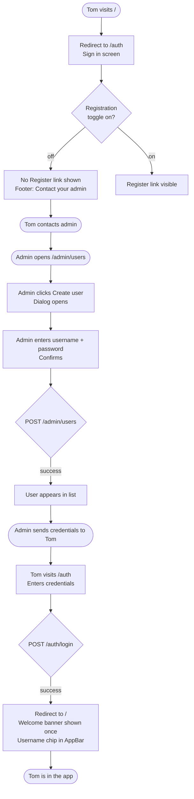
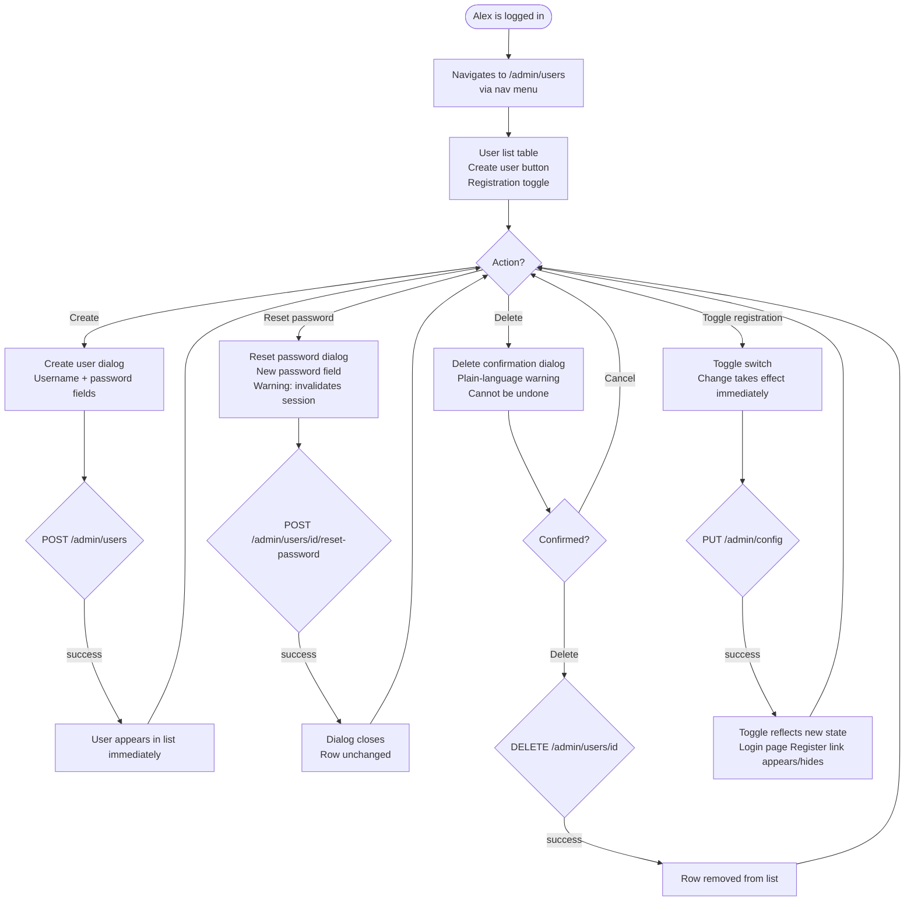
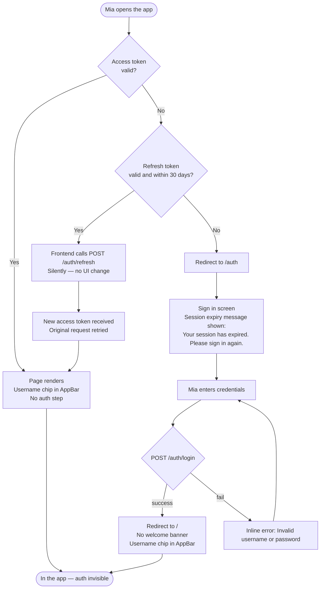

# UX Design Specification bag-please

**Author:** md
**Date:** 2026-05-08

---

## Executive Summary

### Project Vision

bag-please is a shared household shopping list and store management application.
This UX design covers the addition of **user registration and authentication** —
the first feature that introduces individual user identity to an app that previously
operated on a single shared admin credential.

The UX goal is to make the transition from "shared password" to "your own account"
feel natural and trust-building, without disrupting the simplicity of the existing
experience. The design must serve three distinct actors: the household member
discovering personal ownership, the admin-onboarded newcomer, and the admin managing
the user base with confidence.

### Target Users

**Household member (Mia)**
Regular user, mobile-first, tech-comfortable. Currently shares the admin password
with a partner — the app has never felt like hers. Wants frictionless registration
and a clear signal that she now has her own account.

**Admin-onboarded user (Tom)**
Arrives when public registration is closed; credentials provided by admin. Less
motivated by the auth experience itself — just wants to get in and use the app.
Password change is optional, self-service.

**Admin (Alex)**
Power user with full visibility over the user base. Values safe, deliberate controls:
confirm before destructive actions, immediate feedback on config changes, no ambiguity
about what an action does. Also uses the app on mobile.

### Key Design Challenges

1. **Identity transition** — Shifting users from a shared credential to a personal
   account without making the familiar app feel foreign. The welcome moment is the
   critical UX pivot.
2. **Context-sensitive login screen** — The login page must handle both states
   (registration enabled / disabled) as intentional UI, not a broken state.
3. **Session lifecycle clarity** — Transparent token refresh paired with explicit,
   friendly messaging on session expiry. Neither should surprise the user.
4. **Destructive admin actions on mobile** — Confirmation dialogs for reset-password
   and delete-user must be deliberate and mobile-safe.
5. **Admin panel discoverability** — Role-conditional navigation must expose the
   admin panel to admins cleanly while remaining invisible to regular users.

### Design Opportunities

1. **Onboarding moment as a trust anchor** — The one-time welcome banner marks a
   meaningful shift from "shared tool" to "personal account." Framed well, it builds
   an emotional connection to the product that persists beyond the first session.
2. **App bar identity as ambient reassurance** — The user's name in the app bar is
   a persistent, low-cost signal of personal ownership. Small detail, high value.
3. **Admin panel as a model of calm control** — A clean, confirmation-first admin
   panel with a small user base sets a standard of clarity that scales well into
   future admin features.

## Core User Experience

### Defining Experience

The core experience of the auth feature is **ambient identity** — the user registers or logs in once, and from that
point the app simply knows who they are. The everyday interaction is not authentication; it is *using the app as
yourself*. Seeing your name, not being interrupted, not being asked to prove yourself again.

The critical gate is login. Without a successful login there is no app access at all — making the login form the
highest-stakes screen in the entire feature.

### Platform Strategy

- **Platform:** Web SPA (Next.js App Router) — no native mobile app
- **Input model:** Touch-primary on mobile; mouse/keyboard on desktop
- **Offline:** Not required
- **Responsive:** Mobile-first throughout; MUI `sx` breakpoints; no fixed-width auth screens
- **Session model:** Access token in memory (15 min), refresh token in httpOnly cookie (30 days) — session continuity is
  a feature, not an edge case

### Effortless Interactions

- **Staying authenticated** — the 30-day refresh window means most users rarely see the login screen after their first
  session; this must work silently and completely
- **Login itself** — one form, two fields, submit on Enter; no CAPTCHA, no multi-step flow, no email verification in v1
- **Seeing your identity** — username in the app bar loads immediately with the page; no skeleton flash, no "loading
  user…" state

### Critical Success Moments

1. **First login after registration** — username appears in the app bar; one-time welcome banner confirms the shift from
   shared credential to personal account
2. **Returning after time away** — open the app, already authenticated, name visible, straight to the list; the login
   screen is never seen
3. **Session expiry handled without confusion** — after 30 days, a clear redirect message ("Your session has expired")
   replaces a silent or cryptic failure
4. **Login failure with a calm, specific message** — wrong credentials return an honest error immediately; no timeout,
   no blank screen

### Experience Principles

1. **Identity is ambient** — auth succeeds once and disappears into the background; users feel known, not managed
2. **The login gate is fast and forgiving** — one clear form, visible labels, Enter submits, instant feedback; no dead
   ends
3. **Session continuity is a feature** — the 30-day refresh token is a UX decision as much as a technical one; users
   should almost never encounter the login screen again after first use
4. **No surprises about auth state** — any change in session state (expiry, logout) is communicated immediately and
   plainly before asking the user to act

## Desired Emotional Response

### Primary Emotional Goals

**Quiet confirmation** — the dominant feeling the app should produce is a low-key
sense that "the app knows who I am." Not excitement, not delight — just the calm
reassurance of recognized identity. Present at every page load via the username in
the app bar; never requiring the user to think about it.

Registration and login are one-time gates, not centrepiece experiences. They should
be competent and unobtrusive: get out of the way fast and leave no negative impression.

### Emotional Journey Mapping

| Moment                                 | Target feeling                                                        |
|----------------------------------------|-----------------------------------------------------------------------|
| Registration (one-time)                | Neutral to slightly positive — "that was easy, done"                  |
| First login / welcome banner           | Mild confirmation — "okay, this is mine now"                          |
| Every subsequent app open              | Calm familiarity — name visible, already in, nothing to do            |
| Error (wrong password, session expiry) | Clear and calm — understood, not alarmed                              |
| Admin managing users                   | In control, no anxiety — actions are clear, consequences are explicit |

### Micro-Emotions

- **Confidence over anxiety** — users should never wonder if they're logged in, who they are, or whether an action went
  through
- **Calm over excitement** — this is a household tool; emotional peaks are noise
- **Trust over skepticism** — clear error messages and explicit confirmation dialogs build trust without requiring
  explanation

### Design Implications

- **Quiet confirmation → username in app bar** loads immediately, always visible, never in a loading state
- **Calm errors → clear, specific message copy** without exclamation marks, alarm colours, or dramatic iconography; MUI
  `Alert` severity `"error"` is sufficient
- **Admin calm control → confirmation dialogs** with plain language stating exactly what will happen; no jargon, no
  softening of consequences
- **Unobtrusive registration/login → bare minimum forms** — only the required fields, no decorative elements, no
  marketing copy; improvement deferred

### Emotional Design Principles

1. **Competent and invisible** — auth infrastructure should feel like running water: noticed only when absent
2. **Calm errors, not apologetic ones** — state what happened and what to do; never alarm, never over-explain
3. **Explicit before destructive** — confirmation dialogs earn trust by being honest about consequences
4. **Improve later** — registration and login UX are intentionally minimal in v1; emotional polish is deferred to a
   future iteration

## UX Pattern Analysis & Inspiration

### Inspiring Products Analysis

**GitHub login (primary reference)**

- Centered card, two fields, full-width submit button — nothing else
- Inline error messages directly below the relevant field; no modals, no toasts
- No CAPTCHA, no multi-step flow, no password complexity checklist
- Fully functional on mobile without a separate mobile design
- Username visible in the global nav after login — ambient, persistent, not announced

This is the standard to match for bag-please auth screens: functional, fast,
legible, no friction.

### Transferable UX Patterns

**Auth screens:**

- Centered card layout (`Paper` + `Stack`) — works at all viewport sizes
- Full-width primary action button — clear tap target on mobile
- Inline field-level error messages — `FormHelperText` with `error` prop,
  not `Snackbar` or floating alerts
- No decorative elements, no illustration, no marketing copy

**Admin panel:**

- Table or list with row-level actions (edit, reset, delete icons/buttons)
- Confirmation dialogs with plain-language copy before destructive actions
- Toggle for registration on/off — `Switch` with immediate feedback

**Navigation / identity:**

- Username in `AppBar` — static text, always visible, no dropdown required in v1

### Anti-Patterns to Avoid

- **Multi-step login** (email first, then password on a second screen) — unnecessary friction
- **CAPTCHA** — not warranted at this user scale; rate limiting covers the security need
- **Password complexity checklists** — deferred to Phase 2; bare minimum in v1
- **Toast/Snackbar for auth errors** — errors belong inline next to the field, not floating
- **Modal-based auth** — dedicated `/auth` page is cleaner and easier to navigate back from
- **Scattered `sx` overrides in components** — visual debt that blocks future theming

### Design Inspiration Strategy

**Adopt:**

- GitHub's centered-card, two-field auth form pattern
- Inline error placement (field-level, not global)
- Username-in-header ambient identity pattern

**Adapt:**

- GitHub's card to match bag-please's custom theme palette and typography
- Admin actions to MUI `Table` + `IconButton` row pattern already used in `ManageCategories`

**Avoid:**

- Anything that adds a step or a decision to the login flow
- Any MUI default visual that signals "generic Material Design" — addressed via theme

### Theme Architecture Decision

All visual customization lives in a central `theme.ts` created at the start of this
feature. Component files use MUI components with **no inline `sx` overrides for
visual style** — only layout/spacing `sx` that cannot go in the theme.

The initial theme establishes:

- **Custom palette** — not MUI default blue; neutral tones that avoid the
  "out-of-the-box Material Design" look
- **Typography** — system-ui or Inter stack instead of Roboto, or explicit Roboto
  with custom scale
- **Component defaults** — `MuiButton`, `MuiTextField`, `MuiPaper` variants set
  once in `createTheme({ components: {} })`

This keeps components clean and the theme the single source of truth for the
visual language — ready for a full custom theme in a future iteration without
touching component files.

## Design System Foundation

### Design System Choice

**MUI v9** — the existing design system, retained and extended. No migration or
replacement. The investment in this step is architecture, not library selection.

### Rationale for Selection

- Already integrated: `@mui/material` v9, `@mui/icons-material`, `@mui/lab`,
  Emotion — all in place
- Component library covers all auth and admin needs without additions
- Theming system (`createTheme`) supports full visual customization without
  touching component files
- Accessibility defaults (keyboard nav, ARIA, focus rings) are built in
- Consistent with the existing `ManageCategories`, `ItemsList`, and dialog patterns

### Implementation Approach

A `src/lib/theme.ts` file is created at the start of this feature and registered
once in `RootLayout` via `ThemeProvider`. All new auth and admin components use
MUI components directly — no custom component wrappers, no style libraries alongside.

**Rule:** Components may use `sx` for **layout and spacing only**
(e.g. `mt`, `gap`, `width: "100%"`). Visual style (colour, typography, border,
shadow, hover state) belongs in the theme, not in component files.

### Customization Strategy

**Palette — dark/neutral**

- `mode: "dark"` base
- Background: near-black (`#0e0e10` or equivalent) — not pure black
- Surface/paper: slightly elevated dark (`#1a1a1d`)
- Primary accent: TBD in visual design phase — a desaturated or cool-toned
  accent that avoids the MUI default blue
- Error: standard red, slightly muted (not `#f44336` default)
- Text: off-white primary (`#e8e8e8`), muted secondary

**Typography**

- Font family: `Inter, system-ui, sans-serif` — loaded via `next/font` or
  Google Fonts; replaces Roboto as the default
- Scale: MUI defaults are acceptable as a starting point; adjust `h6` and
  `body2` sizes for mobile readability if needed

**Component defaults in theme (not in components):**

- `MuiButton` — slightly rounded (`borderRadius: 6`), no uppercase transform,
  consistent padding
- `MuiTextField` — `variant: "outlined"` as default; reduced label float
  animation if distracting
- `MuiPaper` — subtle border instead of default box-shadow on dark backgrounds
- `MuiAppBar` — flat, no elevation shadow; background from palette

**Future-proofing:**

- All colour values defined as palette tokens — no hardcoded hex in components
- Theme shape and spacing left at MUI defaults for now; adjustable without
  component changes
- A future custom theme replaces `theme.ts` only; zero component file changes
  required

## Core User Experience (Defining Interaction)

### Defining Experience

**"You open the app and it knows who you are."**

The defining experience of the auth feature is not registration or login — those
are one-time events. The everyday reality is ambient authenticated presence: the
user opens bag-please and is already in, already identified, name visible in the
app bar. Auth is invisible.

### User Mental Model

Users bring a simple mental model: *"I have an account, the app remembers me."*
They expect to be logged in unless something has changed. They expect their name
to appear immediately — not after a loading step, not after a redirect. The app
should behave like any app they already trust: silent session persistence by default,
explicit login only when genuinely necessary.

The shift from the current shared-credential model is subtle but significant:
the app now has *their* name, not the admin's. That single detail reframes the
relationship with the product.

### Success Criteria

- Username appears in the `AppBar` on every page load with no visible loading state
- After the first login, users never see the login screen again for at least 30 days
- Token refresh happens silently — zero user interaction, zero visible feedback
- On session expiry, the user sees a clear message before being asked to act
- First-time welcome banner appears exactly once, then never again

### Pattern Analysis

All patterns used are **established and familiar** — no novel interaction design
required. Login form, session cookies, username in nav: these are patterns every
user already understands from dozens of other apps. The goal is to execute them
cleanly, not to innovate.

The only mildly novel moment is the one-time welcome banner — but it follows the
established pattern of onboarding messages and requires no user education.

### Experience Mechanics

**Path A — Active session (everyday case)**

1. *Initiation:* User navigates to any app URL
2. *Interaction:* Apollo client sends request with valid access token; page renders normally
3. *Feedback:* Username visible in `AppBar` immediately; no auth step, no loading state
4. *Completion:* User is on the page they wanted — auth is invisible

**Path B — Expired access token, valid refresh token (within 30 days)**

1. *Initiation:* User navigates; Apollo detects 401 response
2. *Interaction:* Frontend silently calls `POST /auth/refresh`; receives new access token; retries original request
3. *Feedback:* None visible — page renders as if nothing happened
4. *Completion:* User is on the page they wanted — refresh is invisible

**Path C — Expired refresh token (after 30 days)**

1. *Initiation:* User navigates; no valid refresh token available
2. *Interaction:* Frontend redirects to `/login`
3. *Feedback:* Login page shows: *"Your session has expired. Please log in again."*
4. *Completion:* User logs in → returned to their destination or home

**Path D — First login after registration**

1. *Initiation:* Registration succeeds; auto-login fires
2. *Interaction:* User lands on home page
3. *Feedback:* One-time welcome banner: *"Welcome, [username]! You now have your own account."* + username in `AppBar`
4. *Completion:* Banner dismissed (or auto-hides); user is in the app as themselves

## Visual Design Foundation

### Color System

**Mode:** `dark`

| Token                | Value     | Usage                                      |
|----------------------|-----------|--------------------------------------------|
| `background.default` | `#0e0e10` | Page background                            |
| `background.paper`   | `#1a1a1d` | Cards, dialogs, app bar                    |
| `primary.main`       | `#4db6a8` | Buttons, links, focus rings, active states |
| `primary.dark`       | `#3a9d96` | Hover state on primary                     |
| `text.primary`       | `#e8e8e8` | Body text, labels, headings                |
| `text.secondary`     | `#9e9e9e` | Helper text, captions, placeholders        |
| `error.main`         | `#d9534f` | Inline errors, destructive states          |
| `divider`            | `#2e2e32` | Borders, separators, `MuiPaper` border     |

**Contrast (WCAG AA compliance):**

- `#4db6a8` on `#0e0e10` — ~6.7:1, passes AA for normal text and AAA for large text
- `#e8e8e8` on `#0e0e10` — ~17:1, passes AAA
- `#9e9e9e` on `#0e0e10` — ~7:1, passes AAA

### Typography System

**Font family:** `Inter, system-ui, -apple-system, sans-serif`
Loaded via `next/font/google` — no separate stylesheet import needed.

**Scale:** MUI defaults — no overrides to the type scale in v1.
Adjust only if mobile readability testing reveals issues.

**Key overrides in theme:**

- `MuiButton`: `textTransform: "none"` — sentence case, not ALL CAPS
- All other typography: MUI defaults

### Spacing & Layout Foundation

**Base unit:** 8px (MUI default — `theme.spacing(1) = 8px`)
**Gaps and padding:** Standard MUI component defaults throughout — no custom spacing scale.
**Grid:** No CSS grid system; MUI `Stack` and `Box` for layout composition.
**Max-width on auth screens:** `sm` breakpoint cap (`400px`) for the login/register
card — centered on desktop, full-width on mobile.

### Accessibility Considerations

- All form inputs have visible, associated `<label>` elements (MUI `TextField` default)
- Focus rings use `primary.main` teal — visible on dark background
- Error states use `error.main` with `FormHelperText` — both colour and text signal
- Confirmation dialogs are keyboard-navigable and closable with Escape
- All contrast ratios meet WCAG AA; most meet AAA
- `next/font` handles font loading — no layout shift from font swap

## Design Direction Decision

### Design Directions Explored

Four directions were evaluated across login, register, admin panel, and UI states:

1. **Minimal Card** — centered card, no branding (GitHub-faithful)
2. **Branded Entry** — card with app mark above; ready for future logo
3. **Edge-to-Edge** — no card; form on bare background, mobile-native ✓ chosen
4. **Inline Tabs** — login and register on the same card, tab-switched

All directions shared the same admin panel layout, confirmation dialogs, and
welcome banner/session expiry states.

### Chosen Direction

**Direction 3 — Edge-to-Edge**

Form content sits directly on the dark background (`#0e0e10`) with horizontal
padding — no `Paper` card wrapper on auth screens. The layout is full-width up
to a max-width cap (`360px`) centred on desktop, edge-to-edge on mobile.

**AppBar identity:** Username displayed as a small chip with an avatar initial
(first letter of username) and the username text. Stronger identity signal than
plain secondary text; implemented as a simple `Box` + `Typography` in the AppBar,
styled in the theme.

### Design Rationale

- **Mobile-first** — no card boundary means the form feels native on a phone
  screen rather than a web widget embedded in a page
- **Consistent with the dark theme** — a card on a dark background creates a
  layered-surface effect that adds visual complexity without adding value; flat
  edge-to-edge removes that layer
- **Username chip** — the avatar initial gives users a stronger ambient identity
  signal than muted secondary text; low implementation cost, higher perceived value
- **Minimal extra code** — fewer MUI `Paper` components; `Stack` + `Box` only

### Implementation Approach

- Auth pages (`/auth/page.tsx`, `/auth/register/page.tsx`) use `Box` + `Stack`
  directly, no `Paper` wrapper
- Max-width constraint: `sx={{ maxWidth: 360, mx: "auto", px: 2, py: 5 }}`
- AppBar username chip: `Box` with `border-radius: 20px`, avatar initial `Box`,
  username `Typography` — all styled via theme component overrides, not inline `sx`
- Admin panel (`/admin/users/page.tsx`) retains the `Paper`-wrapped table — the
  card boundary is appropriate there for content grouping

## User Journey Flows

The PRD defines four user journeys. The flows below map each to screen-level
mechanics — what the user sees, what they do, and what the UI does in response.

### Journey 1 — First Registration (Mia)

```mermaid
flowchart TD
    A([User visits /]) --> B{Has valid\nrefresh token?}
    B -- No --> C[Redirect to /auth]
    C --> D[Sign in screen\nedge-to-edge form]
    D --> E[User taps Register link]
    E --> F[/auth/register\nCreate account form]
    F --> G[User fills username + password\nTaps Create account]
    G --> H{POST /auth/register}
    H -- username taken --> I[Inline error:\nUsername already taken]
    I --> F
    H -- success --> J{POST /auth/login\nauto-login}
    J -- success --> K[Redirect to /]
    K --> L[Home page\nWelcome banner shown once\nUsername chip in AppBar]
    L --> M([User is in the app])
```

### Journey 2 — Admin-Created Account (Tom)



### Journey 3 — Admin User Management (Alex)



### Journey 4 — Session Lifecycle (Mia returning)



### Journey Patterns

**Navigation pattern — auth redirect:**
All protected routes redirect to `/auth` when unauthenticated. Post-login,
the user is returned to `/` (not the original route — deferred to Phase 2).

**Feedback pattern — inline errors only:**
All form errors appear inline via `FormHelperText` with `error` prop. No
`Snackbar`, no `Alert` floating at the top of the page. One error per field maximum.

**Confirmation pattern — explicit dialogs before destructive actions:**
Delete and reset-password always open a `Dialog` with plain-language copy
stating the exact consequence. Cancel is always the default-focus button.
Destructive button is `error` colour.

**State feedback pattern — immediate:**
All mutations (create user, delete, toggle registration) update the UI
immediately on success. No manual refresh required — Apollo cache updates
or direct state mutations.

### Flow Optimization Principles

1. **Minimum steps to value** — registration → auto-login → welcome → in the app
   is four steps with zero user decisions after form submit
2. **No dead ends** — every error state has a clear recovery action visible
   on the same screen
3. **Registration toggle is instantly reflected** — login page reacts to the
   config change without a reload; admin sees the toggle state update immediately
4. **Session expiry is never silent** — the redirect always carries a message;
   users never arrive at the login screen without knowing why

## Component Strategy

### Design System Components

MUI v9 provides full coverage for all structural and interactive needs.
No third-party component library additions required.

**Used directly (no custom wrapping):**

- `TextField` — auth form fields, admin create/reset dialogs
- `Button` — form submit, dialog actions
- `Box` / `Stack` — all layout composition
- `Typography` — headings, body text, labels
- `AppBar` / `Toolbar` — global navigation bar
- `IconButton` — row actions (reset, delete), hamburger menu
- `Dialog` / `DialogTitle` / `DialogContent` / `DialogActions` — confirmation dialogs
- `Table` family — admin user list
- `Switch` — registration toggle
- `FormHelperText` — inline field errors and helper text
- `Menu` / `MenuItem` / `Divider` — navigation dropdown (existing)
- `Alert` — session expiry message on login screen

### Custom Components

#### `UserChip`

**Purpose:** Displays the authenticated user's identity in the AppBar — avatar
initial + username. Replaces plain `Typography` for a stronger identity signal.

**Anatomy:** Small rounded container (`Box`) → avatar circle with first-letter
initial (`Box`) → username (`Typography`)

**States:** Single state — always shown when authenticated; not rendered when
unauthenticated

**File:** `app/AppHeader.tsx` (inline) or `app/auth/UserChip.tsx` if reused

**Theme:** Styled entirely via `theme.components` — no `sx` in component file

---

#### `ConfirmDialog`

**Purpose:** Reusable confirmation dialog for destructive admin actions. Single
component handles both delete-user and reset-password flows via props.

**Props:** `open`, `title`, `message`, `confirmLabel`, `confirmColor`
(`"error"` | `"primary"`), `onConfirm`, `onCancel`, optional `children` (for
extra form fields like new password input)

**States:** Open / closed; confirm button loading state during async operation

**Accessibility:** Cancel button receives initial focus; Escape closes dialog;
confirm button labelled explicitly

**File:** `app/admin/ConfirmDialog.tsx`

---

#### `WelcomeBanner`

**Purpose:** One-time dismissible banner shown after first successful login
post-registration. Never shown on subsequent logins.

**Behaviour:** Visibility controlled by a React `useState` flag set to `true`
after auto-login; not persisted to localStorage or DB; disappears on dismiss
or page navigation

**Anatomy:** Teal-tinted `Box` → welcome text with username → close `IconButton`

**File:** `app/store/WelcomeBanner.tsx` (rendered on home page)

---

### Updates to Existing Components

| Component                           | Change                                                                                                                 |
|-------------------------------------|------------------------------------------------------------------------------------------------------------------------|
| `LoginPage` (`app/auth/page.tsx`)   | Edge-to-edge layout; inline `FormHelperText` errors; session expiry `Alert`; conditional Register link based on config |
| `AppHeader` (`app/AppHeader.tsx`)   | Add `UserChip` when `username` available in auth context; admin "User Management" nav link for admin role              |
| `Navigation` (`app/Navigation.tsx`) | Add admin-only "User Management" `MenuItem` linking to `/admin/users`                                                  |

### New Pages

| Page                 | Route               | Description                                                                                     |
|----------------------|---------------------|-------------------------------------------------------------------------------------------------|
| `RegisterPage`       | `/auth/register`    | Edge-to-edge registration form; username + password fields; inline errors; link back to sign in |
| `AdminUsersPage`     | `/admin/users`      | User table with row actions; `ConfirmDialog` for delete and reset; registration `Switch`        |
| `ChangePasswordPage` | `/account/password` | Self-service password change; current + new password fields; success confirmation               |

### Implementation Roadmap

**Must-have for Phase 1 (all required for launch):**

1. `theme.ts` — establish before any other component work
2. `LoginPage` update — edge-to-edge + errors + session expiry message
3. `RegisterPage` — new auth entry point
4. `UserChip` + `AppHeader` update — ambient identity signal
5. `WelcomeBanner` — first-login confirmation moment
6. `AdminUsersPage` + `ConfirmDialog` — admin user management
7. `ChangePasswordPage` — self-service password change
8. `Navigation` update — admin nav item

**Deferred to Phase 2:**

- User status (active/suspended) UI in admin panel
- Richer onboarding flow
- Password complexity indicator

## UX Consistency Patterns

### Button Hierarchy

**Primary action** — `Button variant="contained"` (teal background, dark text)
Used for: form submit (Sign in, Create account, Reset, Delete confirm).
One per screen or dialog maximum.

**Secondary / cancel action** — `Button variant="outlined"`
Used for: Cancel in dialogs, secondary nav actions.
Always paired with a primary; never appears alone.

**Destructive action** — `Button variant="contained" color="error"`
Used for: Delete confirm button in `ConfirmDialog` only.
Never used for recoverable actions.

**Icon actions** — `IconButton`
Used for: row-level admin actions (reset password, delete), banner dismiss.
`title` prop required on all `IconButton` instances.

**Rule:** No `ALL CAPS` text on any button — `textTransform: "none"` in theme.

### Feedback Patterns

**Inline field error** — `FormHelperText error`
When: field-level validation failure (username taken, invalid credentials).
Where: directly below the relevant `TextField`.
Copy: specific and calm ("Invalid username or password", "Username already taken").
Never use `Snackbar` or floating `Alert` for form errors.

**Page-level info message** — `Alert severity="warning"`
When: session expiry redirect only.
Where: top of the login form, above the heading.
Dismissed automatically when user starts typing or navigates away.

**Success state — welcome banner** — `WelcomeBanner`
When: first login after registration only.
Where: top of home page content area, below `AppBar`.
Dismissed by user or on page navigation; never reappears.

**No success toasts** — mutations that succeed are confirmed by the immediate
UI change (row appears/disappears, dialog closes). No `Snackbar` "Saved!" messages.

### Form Patterns

**Validation timing:** on submit only — not on blur, not on keystroke.

**Error clearing:** errors clear when the user modifies the field value.

**Submit on Enter:** all single-column forms submit on Enter from any field.

**Loading state on submit:** primary action button shows `CircularProgress`
(replacing button text) during async operations; button disabled while loading.

**Field order:** username always before password.

**Labels:** always visible `<label>` via `TextField label` prop — never placeholder-only.

### Navigation Patterns

**Auth guard:** unauthenticated users hitting any protected route are redirected
to `/auth` immediately.

**Admin guard:** non-admin users hitting `/admin/*` are redirected to `/`.

**Admin nav item:** rendered only when the authenticated user's role is `admin`.

**Post-login destination:** always `/` in Phase 1.

**Logout:** clears auth state and redirects to `/auth` immediately.

### Modal & Dialog Patterns

**Trigger:** dialogs open from explicit user action only — never auto-open.

**Focus:** on open, focus moves to the Cancel button (safe default).

**Escape:** always closes the dialog (MUI `Dialog` default).

**Copy rules:**

- Title: action + object ("Delete user?", "Reset password?")
- Body: consequence in plain language; include username where relevant
- Confirm: matches title verb ("Delete", "Reset")
- Cancel: always "Cancel"

**Width:** `maxWidth="xs"` for all confirmation dialogs.

### Loading & Empty States

**Auth screen loading:** no skeleton — form renders immediately; loading state
is only on the submit button.

**Admin user list — empty state:** single row with muted text
"No users yet. Create the first one." — no illustration.

**Admin user list — loading:** `CircularProgress` centred in the table area
while fetching; table header still visible.

## Responsive Design & Accessibility

### Responsive Strategy

**Approach:** Mobile-first throughout. All new components are designed for
a ~360px viewport and scale up — not the reverse.

**Auth screens:** Edge-to-edge layout naturally adapts. `Box` with
`maxWidth: 360` and `mx: "auto"` centres the form on desktop without
a card boundary. No layout change needed between mobile and desktop.

**Admin panel:** `Table` component collapses gracefully on mobile via
MUI's responsive defaults. Row actions (`IconButton`) remain accessible
at all sizes. Registration toggle is full-width on mobile.

**AppBar:** `UserChip` and hamburger menu fit the existing AppBar layout.
No breakpoint-specific changes needed.

### Breakpoint Strategy

**System:** MUI default breakpoints — no custom values.

| Breakpoint | Width     | Behaviour                                                   |
|------------|-----------|-------------------------------------------------------------|
| `xs`       | 0–600px   | Primary target; edge-to-edge forms, full-width buttons      |
| `sm`       | 600–900px | Auth form max-width cap (360px) kicks in; form centred      |
| `md`+      | 900px+    | Same as `sm`; no additional layout changes for auth screens |

**Admin panel** uses the same breakpoints. Table is readable at `sm`+;
on `xs` horizontal scroll is acceptable given the small user base.

### Accessibility Strategy

**Target:** WCAG 2.1 Level AA.

**Contrast:** All colour pairs already verified against AA (see Visual
Design Foundation — all pairs exceed 4.5:1; most exceed 7:1).

**Keyboard navigation:**

- MUI components handle tab order, Enter/Space activation, and Escape
  dismissal by default
- `Dialog` traps focus correctly via MUI's built-in focus trap
- Form fields are navigable in logical source order (username → password → submit)
- `ConfirmDialog` opens with focus on Cancel (safe default)

**Screen readers:**

- All `TextField` instances use the `label` prop — generates associated
  `<label>` elements automatically
- `FormHelperText` with `error` prop sets `aria-describedby` on the field
- `IconButton` instances carry `title` prop — used as accessible name
- `Switch` for registration toggle carries a `FormControlLabel` with visible text
- `Alert` for session expiry uses `role="alert"` (MUI default) — announced
  immediately by screen readers

**Touch targets:** MUI defaults — `Button` 36px, `IconButton` 40px.
Meets WCAG 2.5.5 at Level AA; 44px (AAA) deferred to a future iteration.

**Focus indicators:** MUI dark mode focus rings use `primary.main` teal
(`#4db6a8`) — clearly visible against `#0e0e10` background.

**No motion:** No custom animations added in v1. MUI's default transitions
are subtle; no autoplay, no infinite loops.

### Testing Strategy

**Responsive:**

- Test on physical device (phone) at each PR before merge — auth form,
  admin table, dialogs
- Chrome DevTools device emulation for quick iteration
- Target: Chrome, Firefox, Safari (current versions)

**Accessibility:**

- Keyboard-only navigation smoke test on each new screen before merge:
  tab through all fields, submit with Enter, open/close dialogs with keyboard
- Browser built-in accessibility inspector (Chrome Accessibility panel)
  for ARIA label verification
- Manual checks sufficient at this scale; no automated a11y CI tooling in v1

### Implementation Guidelines

- Use `TextField label` prop — never `placeholder` as a substitute for a label
- Use MUI `TextField` `helperText` + `error` props for errors — handles
  `aria-describedby` automatically
- All `IconButton` instances must have a `title` prop
- `Dialog` components must not suppress MUI's built-in focus trap
- Breakpoint-specific `sx` uses MUI object syntax:
  `sx={{ px: { xs: 2, sm: 4 } }}` — never `@media` strings inline
- All `sx` spacing values use `theme.spacing()` multiples — no raw `px`
  values for spacing
